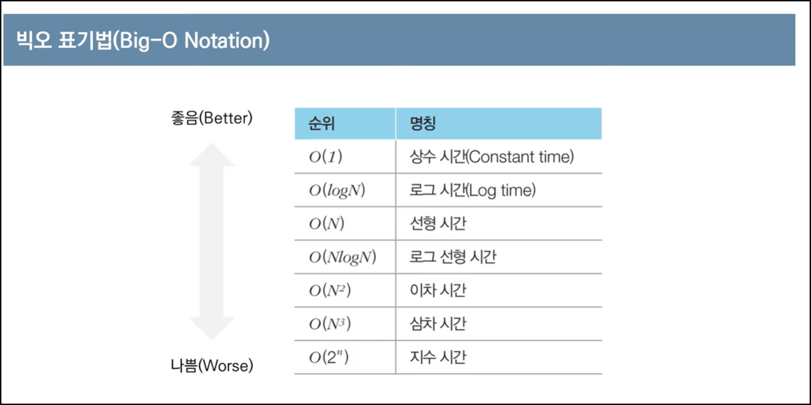
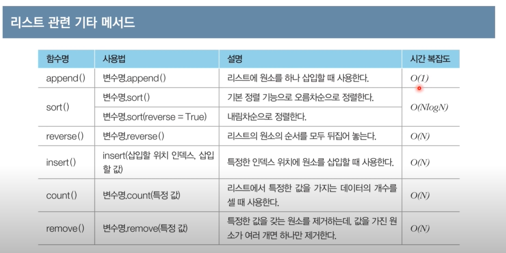

- 코딩테스트를 시행하는 이유
    1. 문제 해결 역량 평가
    2. 응시자의 수를 효과적으로 줄일 수 있음 (특히 대기업 공채에서 효과적임)
- 온라인 / 오프라인 차이
    - 온라인 : 보통 인터넷 검색 허용됨
    - 오프라인 : 검색 허용되지 않는 경우가 많음
    - 둘 다 시행하는 경우도 있음
- 문제의 시간제한은 통상 1~5초 가량
- 문제에서 가장 먼저 확인할 사항
    - 시간제한(수행시간 요구사항). 요구사항에 따라 적절한 알고리즘을 설계해야 함.
- 알고리즘 문제 해결 과정
    1. 지문 읽고 컴퓨터적 사고
    2. 요구사항(복잡도) 분석
    3. 문제 해결을 위한 아이디어 찾기
    4. 소스코드 설계 및 코딩

1. 백준 온라인 저지
    
    [Baekjoon Online Judge](https://www.acmicpc.net/)
    
2. 프로그래머스
    
    [프로그래머스](https://programmers.co.kr/)
    
- 가장 출제 빈도가 높은 알고리즘 유형
    - 그리디 (쉬운 난이도)
    - 구현
    - DFS/BFS를 활용한 탐색

### 복잡도

- 복잡도 : 알고리즘의 성능을 나타내는 척도
    - 시간 복잡도: 특정한 크기의 입력에 대하여 알고리즘의 수행 시간 분석
    - 공간 복잡도: 특정한 크기의 입력에 대하여 알고리즘의 메모리 사용량 분석
- 일반적으로 복잡도가 낮을수록 좋은 알고리즘임
- 어떻게 표기할 수 있을까? ⇒ **빅오 표기법(Big-O Notation)** 사용
    - 가장 빠르게 증가하는 항만을 고려하는 표기법.
    
    
    

# 파이썬 문법

### 정수형/실수형

- 코테에서 이 정수형을 주로 다루게 됨.
- 실수형 : 4바이트, 8바이트 등 고정된 크기의 메모리를 할당하므로 컴퓨터 시스템은 실수 정보를 표현하는 정확도에 한계를 가짐. (ex - 10진수에서 0.3+0.6=0.9 이지만, 2진수는 정확히 표현할 방법이 없음. 미세한 오차 발생)
    
    ⇒ `round()` 함수를 이용하는 것이 권장됨. 주로 반올림해서 소수점 아래 몇째자리 까지의 정확성을 보장함.
    

### 지수 표현 방식

- 파이썬에선 e나 E를 이용해 지수 표현 방식을 사용할 수 있음.
- e나 E 다음에 오는 수는 10의 지수부를 의미함.
- 1e9 ⇒ 10의 9제곱
- **최단 경로 알고리즘**에서는 도달할 수 없는 노드에 대하여 최단 거리를 무한(INF)로 설정하곤 함.
⇒ 이때, 가능한 최댓값이 10억 미만이라면 무한(INF)의 값으로 1e9를 이용할 수 있음.

### 주로 사용하는 연산자

- 나누기 연산자(/) 사용 시 주의
    - 파이썬에선 나누기 연산자(/) 사용 시, **실수형으로 반환**됨.
- 나머지 연산자(%)
    - 사용 예시: a가 홀수인지 확인해야 하는 경우
- 몫 연산자(//)
- 거듭 제곱 연산자(**)

## 리스트 자료형

- 연결 리스트와 유사한 기능까지 지원함
- C++의 STL vector와 기능적으로 유사함 (Java는 ArrayList)
- 리스트 대신 배열 혹은 테이블이라 부르기도 한다.
- 거꾸로 인덱싱 가능 (음수 활용)
    
    ```python
    # 뒤에서 첫번째 원소 출력
    print(a[-1])
    ```
    
- **슬라이싱(Slicing)**
    - 연속적인 위치를 갖는 원소들을 가져와야 할 때 사용
    - 대괄호 안에 콜론(:)을 넣어서 **시작 인덱스**와 **끝 인덱스** 설정 가능
    - 참고: 끝 인덱스는 실제 인덱스보다 1을 더 크게 설정함
        
        ```python
        a = [1, 2, 3, 4, 5, 6, 7, 8, 9]
        
        # 두번째 ~ 네번째 원소 출력
        print(a[1 : 4])    # [1:3] 일 것 같은데 4까지 써줘야 함
        ```
        
- **리스트 컴프리헨션**
    - 리스트를 초기화하는 방법 중 하나. 대괄호 안에 조건문과 반복문을 적용해 리스트를 초기화 할 수 있다.
    
    ```python
    array = [i for i in range(10)]
    print(array)
    
    # 결과 : [0, 1, 2, 3, 4, 5, 6, 7, 8, 9]
    ```
    
    ```python
    # 0 ~ 19까지의 수 중 홀수만 포함하는 리스트
    array = [i for i in range(20) if i % 2 == 1]
    
    # 1 ~ 9까지의 수들의 제곱 값을 포함하는 리스트
    array = [i * i for i in range(1, 10)]
    ```
    
    - **2차원 리스트**를 초기화할 때 효과적으로 사용할 수 있음. (N x M 크기)
        
        ```python
        # 좋은 예시
        array = [[0] * m for _in range(n)]
        
        # 잘못된 예시 (전체 리스트 안에 포함된 각 리스트가 모두 같은 객체로 인식되어버림)
        array = [[0] * m] * n
        ```
        
    

### 언더바 사용은 언제?

- 파이썬에선 반복을 수행할 때, 반복을 위한 변수의 값을 무시하고자 할 때 언더바(_)를 자주 씀.
(반복을 위해 사용한 변수가 사용되지 않을 때)
    
    ```python
    # "Hello World"를 5번 출력하기 (변수 불필요)
    for _ in range(5):
    	print("Hello World")
    
    # 1~9까지의 자연수 더하기 (변수가 필요한 상황)
    sum = 0
    for i in range(1, 10):
    	sum += i
    print(sum)
    ```
    

### 리스트 관련, 자주 사용하는 기타 메서드



- `remove()` : `removeAll()` 이 파이썬엔 없기 때문에, 특정한 값을 가진 원소를 모두 제거하기 위해선 별도의 로직이 필요함.
    
    ⇒ **집합** 자료형을 사용해야 함 (특정 원소의 존재 유무를 파악할 때 효과적으로 사용할 수 있음)
    
    ```python
    a = [1, 2, 3, 4, 5, 5, 5]
    remove_set = {3, 5}   # 집합 자료형
    
    #remove_list에 포함되지 않은 값만 저장
    result = [i for i in a if i not in remove_set]
    print(result)
    
    # 결과: [1, 2, 4]
    ```
    

## 문자열 자료형

- 다른 언어와 달리 큰 따옴표(”), 작은 따옴표(’) 모두 사용 가능
- 덧셈과 곱셈을 사용할 수 있음.
- 인덱싱과 슬라이싱 사용이 가능하나, 특정 인덱스의 값을 변경할 수는 없다.

## 튜플 자료형

- 리스트와 유사하나, 한 번 선언된 값을 변경할 수 없다.
⇒ 바뀌면 안되는 데이터를 저장하기 좋겠네.
- 소괄호(`()`)를 이용해 선언하되, 리스트처럼 `[]`로 특정 인덱스 값을 가져올 수 있음.
- 기능이 제한적이지만 리스트에 비해 상대적으로 **공간 효율적**이다. (더 적은 양의 메모리를 사용함)

```python
a = (1, 2, 3, 4, 5, 6, 7, 8, 9)

# 두번째 ~ 네번째 원소 출력
print(a[1 : 4])
```

### 튜플을 사용하면 좋은 경우

- 서로 다른 성질의 데이터를 **묶어서 관리**해야 할 때
(회사에서 만든 NameValue<K,V> 와 비슷할 듯)
    - 최단 경로 알고리즘에서는 (비용, 노드 번호)의 형태로 튜플 자료형을 자주 사용함.
- 데이터의 나열을 해싱(Hasing)의 키 값으로 사용해야 할 때
    - 리스트와 다르게 변경이 불가능하니 키 값으로 사용 가능
- 리스트보다 메모리를 효율적으로 사용해야 할 때

## 사전 자료형


- 키(Key)와 값(Value)의 쌍을 데이터로 가지는 자료형으로, 다른 언어에선 해시 테이블로 불린다.
- 변경 불가능(Immutable) 자료형을 키로 사용할 수 있다.
- 사전 자료형은 해시 테이블(Hash Table)을 이용하므로, 데이터의 조회 및 수정에 있어서 O(1)의 시간에 처리할 수 있다.
- 키와 값을 별도로 뽑아내는 메서드를 제공한다.
    - `keys()` : 키 데이터만 뽑아서 리스트로 이용
    - `values()` : 값 데이터만 뽑아서 리스트로 이용

```python
# 사전 자료형 초기화1
a = dict()
a['key1'] = 1
a['key2'] = 2

# 사전 자료형 초기화2
b = {
	'key3': 3, 
	'key4': 4
}

key_list = list(b.keys())
```

## 집합 자료형


- 중복을 허용하지 않는다.
- 순서가 없다. (⇒ 인덱싱으로 값을 얻을 수 없음)
- 리스트 혹은 문자열을 이용해 초기화 할 수 있다. `set()` 함수 사용.
- 데이터의 조회 및 수정에 있어서 **O(1)**의 시간에 처리할 수 있다.

```python
# 집합 자료형 초기화 방법1
data = set([1, 1, 2, 3, 4, 4, 5])

# 집합 자료형 초기화 방법2
data = {1, 1, 2, 3, 4, 4, 5}
```

- 기본적으로 제공되는 집합 연산: 합집합, 교집합, 차집합

```python
# 합집합
print(a | b)

# 교집합
print(a & b)

# 차집합
print(a - b)
```

## 기본 입출력


### 자주 사용되는 표준 입력 방법 ★★

- `input()` 함수 : 한 줄의 문자열을 입력 받는 함수
- `map()` 함수 : 리스트의 모든 원소에 각각 특정한 함수를 적용할 때 사용

```python
# 이렇게 써주면, 공백값 제거하면서 배열 만들어줌.
# 입력값 : 50 40 78 100
data = input().split()
print(data)

# 결과 : ['50', '40', '78', '100']

# 근데 정수형으로 바꾸고 싶음 -> map() 함수 활용 후 list() 감싸주기
data = list(map(int, input().split()))
print(data)

# 결과 : [50, 40, 78, 100]

# 데이터를 딱 3개만 입력받고 싶다?
a, b, c = map(int, input().split())
print(a, b, c)
```

⇒ 이거 많이 사용된다!! 손에 익을 정도로 많이 연습해둘 것 ★

### 빠르게 입력받는 법

- 파이썬의 sys 라이브러리에 있는 `sys.stdin.readline()` 메서드를 사용
    - 단, 입력 후 엔터(Enter)가 줄바꿈 기호로 입력되므로 `rstrip()` 메서드를 함께 사용

```python
import sys

# 문자열 입력 받기
data = sys.stdin.readline().rstrip()
print(data)
```

### 표준 출력 방법

- `print()` 함수 사용
- 기본적으로 출력 이후에 줄 바꿈을 수행하며, 줄 바꿈을 원치 않는 경우 `end` 속성을 이용할 수 있다.

```python
print(7, end=" ")
print(8, end=" ")

# 출력할 변수
answer = 7
print("정답은" + str(answer) + "입니다.")
```

- `str()` 함수 사용 이유
    - 파이썬은 문자열과 정수형을 직접적으로 더할 수 없어서, 정수형을 문자열로 변환.
- `f-string` 을 사용하면 `str()` 보다 더 간단하게 표현 가능
    - 문자열 앞에 접두사 ‘f’를 붙이면 됨. 파이썬 3.6부터 사용 가능.
    
    ```python
    answer = 7
    print(f"정답은 {answer}입니다.")
    
    # 결과
    # 정답은 7입니다.
    ```
    

## 조건문과 반복문


### 조건문

- 파이썬에선 **코드의 블록(Block)을 들여쓰기(Indent)로 지정**한다.
- `if` ~ `elif` ~ `else`
    - 보통 `else if`를 쓰는데 파이썬은 줄여서 `elif`
- 탭 vs 스페이스 여러번 사용? 두 진영이 나뉘어져 있음. 아직 활발히 논쟁 중.
- 파이썬 스타일 가이드라인 : 4개의 공백 문자로 들여쓰기 하는 것을 권장.

```python
score = 85

if score >= 70:
		print('성적이 70점 이상입니다.')
		if score >= 90:
				print('우수한 성적입니다.')
else:
		print('성적이 70점 미만입니다.')
		print('조금 더 분발하세요.')

print('프로그램을 종료합니다.')       # 이건 무조건 실행됨.

# 실행 결과
# 성적이 70점 이상입니다.
# 프로그램을 종료합니다.
```

- 간소화된 조건문 (if ~ else문을 한줄에 작성할 수 있음)
    
    ```python
    score = 85
    result = "Success" if score >= 80 else "Fail"
    
    print(result)
    ```
    

### 논리 연산자

- 다른 언어와 조금 차이가 있네. 좀 더 직관적이다.
- `X and Y` / `X or Y` / `not X`

```python
a = 15

if a >= 0 and a <= 20:
		print("a는 0 이상, 20 이하의 숫자입니다.")
```

### 기타 연산자

- `in`과 `not in` 연산자가 제공됨. (리스트, 튜플, 문자열, 딕셔너리 모두 사용 가능)
- `pass` : 아무것도 처리하고 싶지 않을 때 사용 가능
    
    ```python
    score = 85
    
    if score >= 80:
    		pass # 나중에 작성할 코드
    else:
    		print('성적이 80점 미만입니다.')
    ```