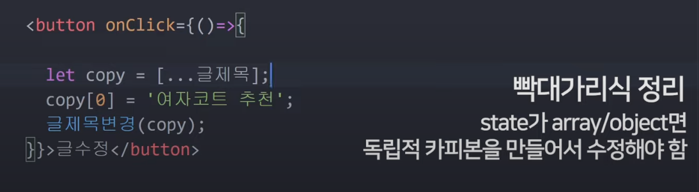

그 놈의 리액트 리액트, 얼마나 재밌나 궁금해서 시간도 생긴 겸 강의 한번 들어본다. 마침 코딩애플님이 너무 내 스타일이니(꿀잼임) 편하게 재미삼아 들어보자.

대체 왜 리액트가 대세인지, 꼭 필요한 것인지 공부하면서 함 알아보기.

## 1. 리액트 설치와 세팅

### 프로젝트 생성

```
npx create-react-app 프로젝트명
```

### local 서버로 미리보기

```
npm start
```

index.js를 통해 App.js 내용을 index.html로 전달.


- JSX문법 사용. js이기 때문에, class라고 쓸 수 없음. 대신 className.
- html대신 굳이 왜 이렇게 쓰냐? 리앵뷰의 장점 -> 데이터 바인딩이 쉽게 되기 때문 ★
- style넣을 때, js문법 때문에 camelCase로 바꿔써야 함. (지저분해지니 따로 변수로 빼서 작업)

```jsx
function App() {

  let posts = '강남 고기 맛집';
  function gogogo(){
    return 100
  }

  return (
    <div className="App">
      <div className='black-nav'>
        <div style={ {color: 'yello', fontSize: '30px'} }>개발 Blog</div>
      </div>
      <h4> { posts } </h4>
      <h4> { gogogo() } </h4>
      </img>     
    </div> 
  );
}
```

데이터는
1. 변수에 넣거나
2. state에 넣거나

## state

- **state**
    
    ⇒ 변수 대신 쓰는 데이터 저장 공간
    
    - 리액트를 웹앱처럼 쓰고 싶다? 중요한 data는 다 state에 넣어서 보관해야 함
    - state는 변경되면 html이 자동으로 재렌더링이 된다. (새로고침 없이도)
- state 변경하는 법
    - 같이 생성되는 함수를 사용해야 함

> (참고) eslint 경고문 없애는 법 : *`/* eslint-disable */`*

- state는 부모→자식으로만 전송됨
    
    
    

## state가 array/object인 경우

### JS의 배열 복사

⇒ array, object는 **reference data type** 이다. (이거 Java나 C#에서도?)


```jsx
let [titles, changeTitles] = useState(['배열1 제목', '배열2 제목']);

<button onClick={() => {
        // copy 변수 생성 이유: array/object 등을 다룰 땐, 원본은 보존하는 게 좋음 (영구적으로 수정x)
        // state변경함수의 동작원리: 기존 state와 신규 state를 비교 후, 같으면 변경 안해줌 (일종의 에너지 절약)
        let copy = [...titles];	        // js의 배열 복사 문법
        console.log(titles == copy);    // false
        copy[0] = '배열1 제목 변경';
        changeTitles(copy);

        /* 안되는 코드 (js array 특징) */
        let arrReference = titles;      // MDN문서: 이렇게 쓰면 배열 복사 안됨. 원본 배열을 가리키는 '참조'만 할당됨.
        arrReference[0] = '배열1 제목 변경';    // 그래서 이렇게 값을 변경 후 state변경함수를 적용하는 게 불가능. arrReference의 화살표는 변하지 않았기 때문.
        console.log(titles == arrReference);    // true
        changeTitles(arrReference);

      }}>제목 수정 버튼</button>
```

- **state변경함수의 동작원리**
    - 기존 state와 신규 state를 비교 후, 같으면 변경 안해줌 (일종의 에너지 절약)
    
    > 결론: state가 array/object다? 그럼 독립된 카피본을 만들어야 함.
    > 
    
    
    

### 문자열 정렬 과제 ⇒ sort() 함수

```jsx
let posts = ['우리집에 왜 왔니', '컬처닷컴이 최고다', '스벨트도 해보고 싶다', '조성진도 좋고 임윤찬도 좋다'];
let [titles, changeTitles] = useState(posts);

{/**문자열 정렬 (오름차순) */}
<button onClick={() => {
  let ascArr = [...posts];   // titles도 되고, posts도 되네?
  ascArr.sort();
  changeTitles(ascArr);
}}>글제목 오름차순 정렬</button>

{/**문자열 정렬 (내림차순) */}
<button onClick={() => {
  let descArr = [...titles]; 
  descArr.sort(function(a, b){
    if(a < b) return 1;
    if(a > b) return -1;
    if(a === b) return 0;
  });
  changeTitles(descArr);
}}>글제목 내림차순 정렬</button>
```

- 내림차순 정렬 시엔 오름차순과 달리, sort 함수 파라마터가 필요하다.
- 정정. 그냥 아래와 같이 쓰는 게 제일 깔끔할 듯.

```jsx
let descArr = [...titles]; 

descArr.sort();      // 오름차순 정렬
descArr.reverse();   // 내림차순 정렬

changeTitles(descArr);
```

## 컴포넌트 만들기 / 동적인 UI 만들기

### 컴포넌트 만드는 법

1. function 만들고
2. return() 안에 html 담기
3. <함수명></함수명> 쓰기

### 컴포넌트 쓰면 좋은 상황

1. 반복적인 html 축약할 때
2. 큰 페이지들
3. 자주 변경되는 것들

### 동적인 UI 만드는 법

1. html, css로 미리 디자인 완성
2. UI의 현재 상태를 state로 저장
3. state에 따라 UI가 어떻게 보일지 작성

### 동적인 UI 예제 - 모달 컴포넌트 열고 닫기

```jsx

let [modal, setModal] = useState(false);

return (
	<div>
		<h3 onClick={ ()=>{ 
		  let isModalOpened = modal == false ? true : false;
		  setModal(isModalOpened); 
		 } }> { titles[3] } </h3>
		
		{
		  modal == true ? <Modal></Modal> : null 
		}
	</div>
)
```

나는 모달창 열고 닫는 코드를 위와 같이 짰는데, 코딩애플님은 더 간단하게 축약하셨네.

```jsx
let [modal, setModal] = useState(false);

  return (
    <div>
      (생략)
      <button onClick={ ()=>{ setModal(!modal) } }> {글제목[0]} </button>

      { 
         modal == true ? <Modal></Modal> : null
      }
    </div>
  )
```

## React에서 반복문

js의 Map을 사용해보자. (for문법은 jsx 안에서 사용할 수 없다)

```jsx
{
	// React에서 반복문 (Vue에선 v-for)
	titles.map(function(title, index) {
	  return (
	    <div className='list' key={index}>
	      <h3> { title } </h3>
	      <p>{ index+1 }번</p>
	      <hr/>
	    </div>
	  )
	})
}
```

### 과제) 좋아요 클릭 이벤트를 각 게시물에 할당하기

- 음, 나는 객체 배열에 넣어서 관리하면 딱일 것이라 생각했는데 js는 뭔가 애매하네.
배열에 밀어넣어줄 때, 애초에 object 타입을 강제해두고 싶은데. 아무렇게나 막 때려넣지 않게.

아래와 같이 정리되었음.

```jsx
let _likeNums = [0, 0, 0, 0];

// 좋아요 상태관리
let [likeNums, setLikeNums] = useState(_likeNums);
```

```jsx
{
  // React에서 반복문
  titles.map(function(title, i) {
    return (
      <div className='list' key={i}>
        <h3> { title } <span onClick={ ()=>{ 
          let newLikeNums = [...likeNums];
          newLikeNums[i] = newLikeNums[i] + 1;
          setLikeNums(newLikeNums);  
          } }>👍</span> { likeNums[i] } </h3>  
        <p>{ i+1 }번</p>
        <hr/>
      </div>
    )
  })
}
```

- 내가 놓쳤던 것
    - state에 있는 배열 값을 바꾸려면, […] 문법으로 새로 배열을 할당했어야 했음.
    

## Props

Modal 컴포넌트에 props로 state 전달해줄거임.

컴포넌트 많아지면, props 많이 써야할 수도. 잘 고민해서 짜야함.

### 과제) 자식 컴포넌트에서 부모 컴포넌트 값 바꾸기 (글 수정)

아래와 같이 부모 컴포넌트 → 자식 컴포넌트로 전송 (modal창)

```jsx
{
  // 모달 컴포넌트 (props 전송)
  modal == true ? <Modal color={'skyblue'} titles={titles} setTitles={setTitles}></Modal> : null      
}
```

```jsx
// 모달 컴포넌트
function Modal(props){

  // html
  return (
    <div className='modal' style={ {background: props.color} }>
      <h4> { props.titles[0] } </h4>
      <p>날짜</p>
      <p>상세내용</p>
      <button onClick={ modifyTitle }>글 수정</button>
    </div>
  )

  // 글 수정 함수
  function modifyTitle(){
    let newTitles = [...props.titles];
    newTitles[0] = '수정된 글1';
    props.setTitles(newTitles);
  }
}
```

### props를 응용한 상세페이지 만들기

- titles 배열에 index 값만 넘겨줄 수 있으면 되는데. 제목 onClick 이벤트 발생 시, 이 index를 넘겨줄 수 있으면 좋겠다고 생각함.
⇒ 결국 Index를 관리하는 state를 새로 하나 만들어야했음.
    
    ```jsx
    let [titleIndex, setTitleIndex] = useState(0);    // 이걸 또 따로 만들어줘야 되는게 불편하네.
    ```
    

그래서 제목 클릭 시, `setTitleIndex(i)`를 통해 index state를 변경해줌.

```jsx
<h3 onClick={ ()=>{ 
    let isModalOpened = modal == false ? true : false;
    setModal(isModalOpened);
    setTitleIndex(i);
   } }>
   { title }
</h3>
```

그러고 나서 Modal 컴포넌트에 props로 `titleIndex`를 넘겨주고, 이를 활용하는 방식.

## onChange / onInput

- `v-on:change`와 같은 기능인가보다.
- 이벤트 핸들링 : 30개 정도나 되니, 다 외우긴 어렵고 그때 그때 찾아쓰기

### 이벤트 버블링 / 이벤트 캡처링

- 이벤트 버블링: 자식 요소에서 발생한 이벤트가 부모 요소로 전파하는 것
- 이벤트 캡처링: 자식 요소에서 발생한 이벤트가 부모 요소부터 시작하여 이벤트를 발생시킨 자식 요소까지 도달하는 것
- `e.stopPropagation()` : 이벤트 버블링을 막아주는 코드.

## class를 사용하는 옛날 React 문법

```jsx
class Modal2 extends React.Component {
  // 채워야 할 3가지: constructor, super, render
  constructor(props){
    super(props);
    this.state = {
      name: 'kim',
      age: 20
    }
  }
  render(){
    return (
      <div>안녕 {this.state.name}, {this.state.age}
        <button onClick={()=>{
          this.setState({age: 21})
        }}>나이 수정 버튼</button>
      </div>
    )
  }
}
```

## 만든 리액트 사이트를 build & Github Pages로 배포해보기

웹브라우저는 html, css, js 3가지만 해석할 수 있다. 리액트의 state, jsx 이런 거 못알아들음.

⇒ build를 해줘야 함.

[http://codingapple.com/](http://codingapple.com/) 여기에 배포하시는 경우엔 따로 설정이 필요없이 대충 하셔도 되지만

[http://codingapple.com/blog/](http://codingapple.com/blog/) 이런 하위 경로에 배포하고 싶으시면 프로젝트에 설정이 따로 필요합니다.

# 일단 리액트 여태까지 해본 후기

아니, 이렇게 복잡할 일인가? Vue.js 보다 훨씬 불편한 느낌이 드는데? 가독성도 그렇고, 기능 구현하기도.

물론 Vue.js 가 쉽고 편하다는 건 알고 있지만… 아직까진 왜 React가 인기 많은지 잘 모르겠음.