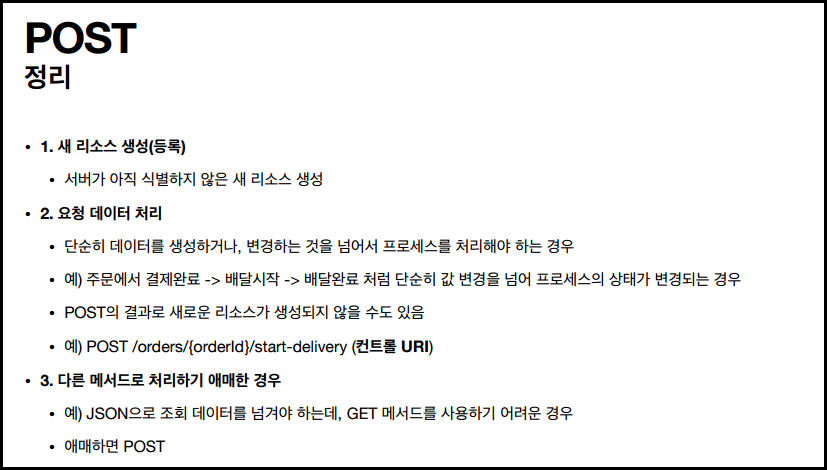
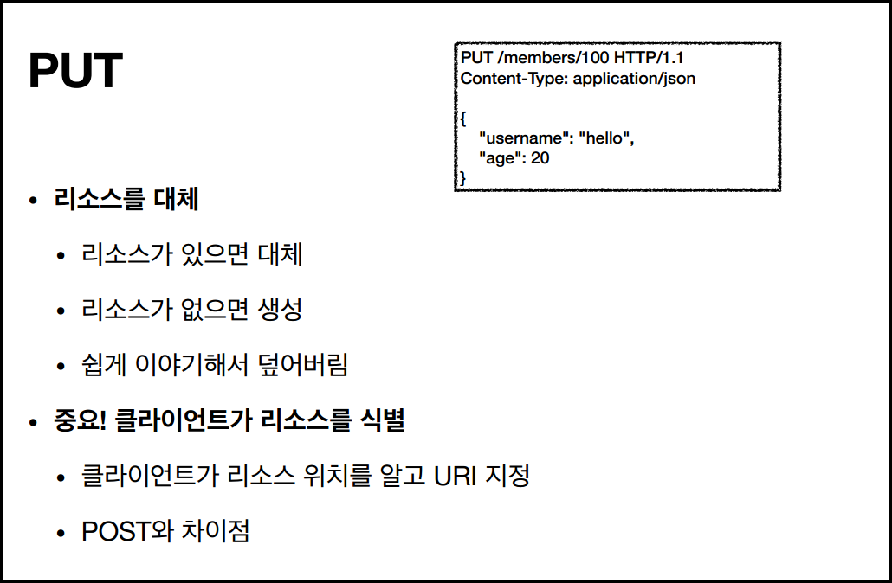
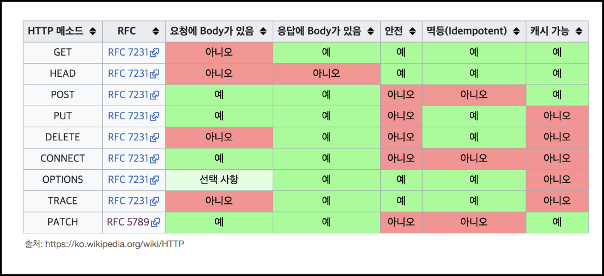
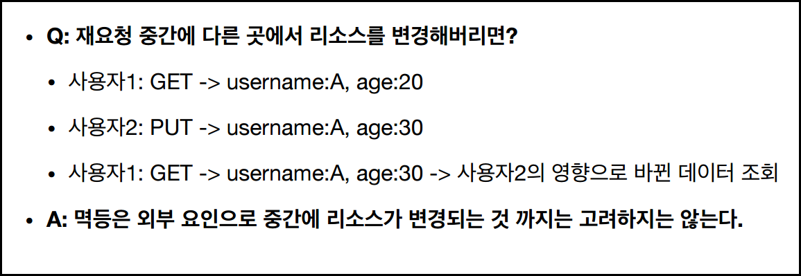
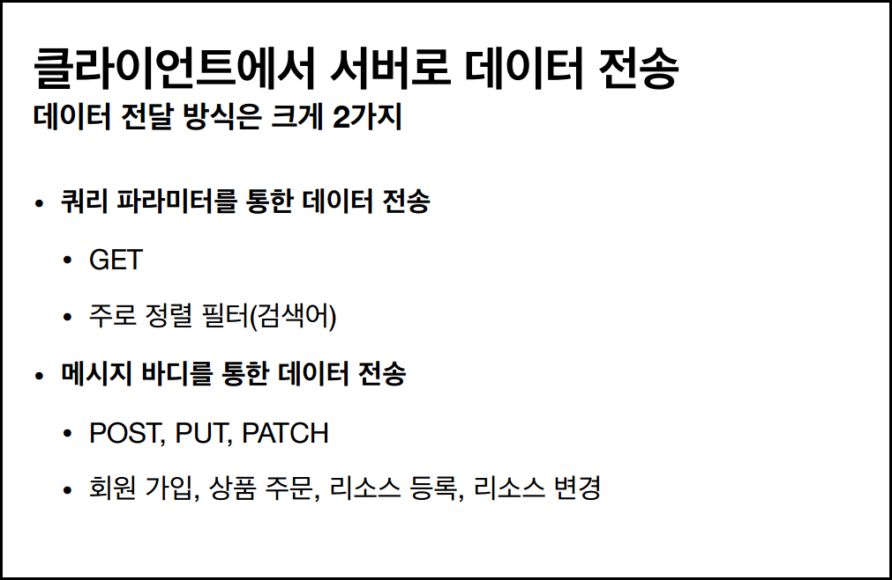
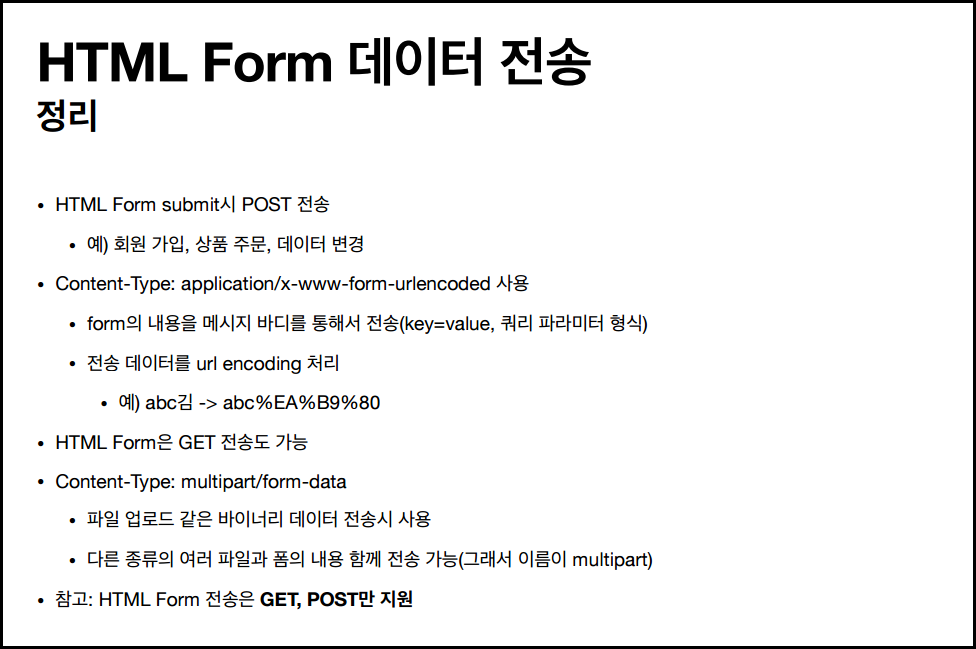
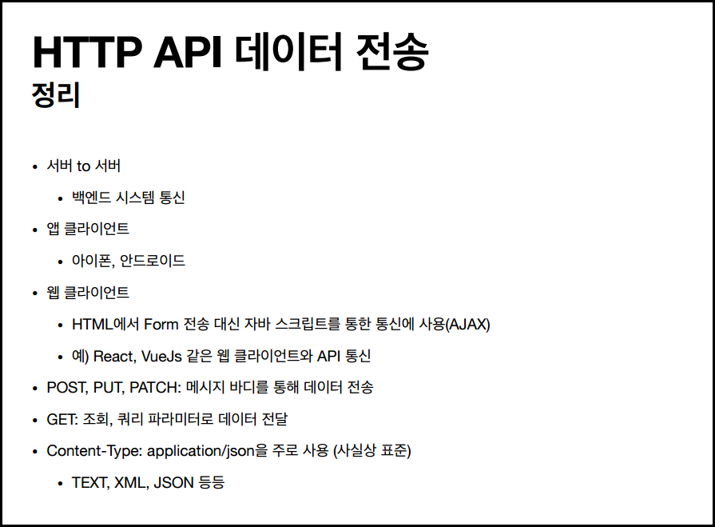
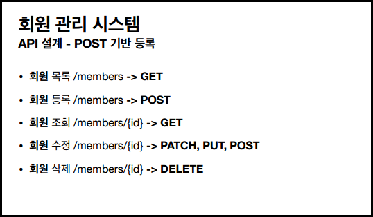
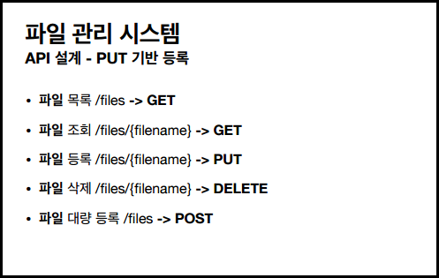
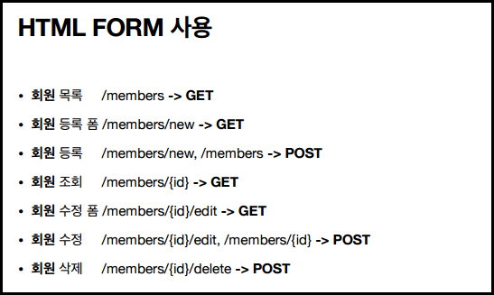

# HTTP API 설계하기

- 요구사항: 회원 정보 관리 API 만들기.
    - 회원 목록 조회 /read-member-list
    - 회원 조회 /read-member-by-id
    - 회원 등록 /create-member
    - 회원 수정 /update-member
    - 회원 삭제 /delete-member

    > 이게 좋은 URI 설계일까⁉

가장 중요한 것: **리소스 식별**

- 등록, 수정, 조회가 리소스가 아님. '회원'이라는 개념이 리소스다.
("미네랄을 캐라" → '미네랄'이 리소스임.)

- 다시 설계해보자.
    - **회원** 목록 조회 /members
    - **회원** 조회 /members/{id}
    - **회원** 등록 /members/{id}
    - **회원** 수정 /members/{id}
    - **회원** 삭제 /members/{id}

    (→ 복수 단어 사용 권장 (members))

    ⇒ 이것들의 구분은 'HTTP 메서드'로.

- 위와 같이, URI는 리소스만 식별해야한다. 
리소스의 '행위(조회, 등록, 삭제, 변경)'는 HTTP 메서드로 구분한다.

 

# HTTP 메서드

- **GET**: 리소스 조회
- **POST**: 요청 데이터 처리, 주로 등록에 사용
- **PUT**: 리소스를 대체, 해당 리소스가 없으면 생성
- **PATCH**: 리소스 부분 변경
- **DELETE**: 리소스 삭제
- 기타 메서드
    - HEAD: GET과 동일하지만 메시지 부분을 제외하고, 상태 줄과 헤더만 반환
    - OPTIONS: 대상 리소스에 대한 통신 가능 옵션(메서드)을 설명(주로 CORS에서 사용)
    - CONNECT: 대상 자원으로 식별되는 서버에 대한 터널을 설정
    - TRACE: 대상 리소스에 대한 경로를 따라 메시지 루프백 테스트를 수행

### GET

- 리소스 조회
- 서버에 전달하고 싶은 데이터는 query(쿼리 스트링)를 통해서 전달
- 메시지 바디를 사용해 데이터를 전달할 수 있지만, 지원하지 않는 곳이 많아서 권장하지 않음

### POST

- 메시지 바디를 통해 서버로 요청 데이터 전달
- 주로 전달된 데이터로 신규 리소스 등록, 프로세스 처리에 사용함
- 애매하면 POST! POST는 무적이다.

### PUT

> 📌 **핵심: 리소스를 '완전히' 대체한다! (기존 리소스를 삭제하고 새로 덮는 것임)**

⇒ PUT은 리소스를 수정하는 것이 아니라, 갈아치우는 개념이다. → 수정하고 싶으면 PATCH를 사용하면 된다.

### PATCH

- 리소스에서 부분적으로 내가 원하는 부분만 변경.
- (가끔 PATCH가 지원안될수도 있는데, 그럴 땐 무적의 POST를 사용하면 됨.)
- 수정할 땐 웬만하면 PATCH를 쓰는게 제일 좋음. (게시글 같은건 PUT이 좋음)

### DELETE

- 리소스 제거

 

# HTTP 메서드의 속성

- 안전(Safe Methods)
- 멱등(Idempotent Methods)
- 캐시가능(Cacheable Methods)

### 안전(Safe)

- 호출해도 리소스를 변경하지 않는다. (GET만 안전함)
- Q) 계속 호출해서 로그 같은 것이 쌓여서 장애가 발생하면??
    - A) 그런 건 고려하지 않는다. 안전은 '해당 리소스'만 고려함.

### 멱등 (Idempotent)

- 한 번 호출하든 두 번 호출하든 100번 호출하든 결과가 똑같다는 개념.
- POST, PATCH를 제외하면 모두 멱등이다. (GET, PUT, DELETE)
    - POST 예시) 2번 호출하면 같은 결제가 중복해서 발생할 수 있음. 배송을 2번 눌러도 중복이고.

> 참고: 외부 요인으로 중간에 리소스가 변경되는 것까진 고려하지 않는다.

### 캐시가능 (Cacheable) ★

- 응답 결과 리소스를 캐시해서 사용해도 되는가?
- 실제론 GET, HEAD 정도만 캐시로 사용함. 
(POST, PATCH도 가능하지만 구현이 쉽지 않음)

 

# 클라이언트에서 서버로 데이터 전송 ★

> 💡 강의자료 중 5.http-method-use.pdf 파일 복습하기 ★

 

# HTTP API 설계 예시

### POST 등록과 PUT 등록의 차이

> 대부분은 POST 방식을 사용함.

- **POST**
    - 서버가 새로 등록된 리소스 URI를 생성해준다.
    - /members
    - **컬렉션(Collection)**
- **PUT**
    - 클라이언트가 직접 리소스의 URI를 지정한다.
    - /files/star.jpg
    - **스토어(Store)**

### HTML FORM 사용

- **GET, POST**만 지원한다.
- 이런 제약을 해결하기 위해 동사로 된 리소스 경로 사용 (/new, /edit, /delete 등)
**⇒ 컨트롤 URI ★**
    - HTTP 메서드로 해결하기 애매한 경우 많이 사용함. (그렇다고 무식하게 막 쓰는건 비추)

    

### 참고하면 좋은 URI 설계 개념

- **문서(document)**
    - 단일 개념 (파일 하나, 객체 인스턴스, 데이터베이스 row 등)
    - 예) /members/100, /files/star.jpg
- **컬렉션(collection)**
    - 서버가 관리하는 리소스 디렉터리
    - 서버가 리소스의 URI를 생성하고 관리
    - 예) /members
- **스토어(store)**
    - 클라이언트가 관리하는 자원 저장소
    - 클라이언트가 리소스의 URI를 알고 관리
    - 예) /files
- **컨트롤러(controller), 컨트롤 URI**
    - 문서, 컬렉션, 스토어로 해결하기 어려운 추가 프로세스 실행
    - 동사를 직접 사용
    - 예) /members/{id}/delete