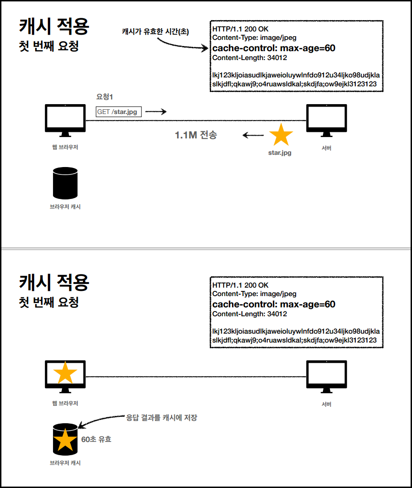
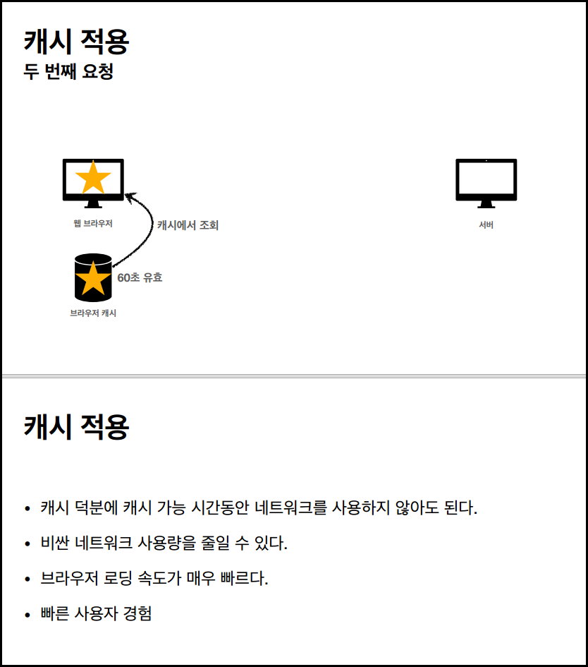
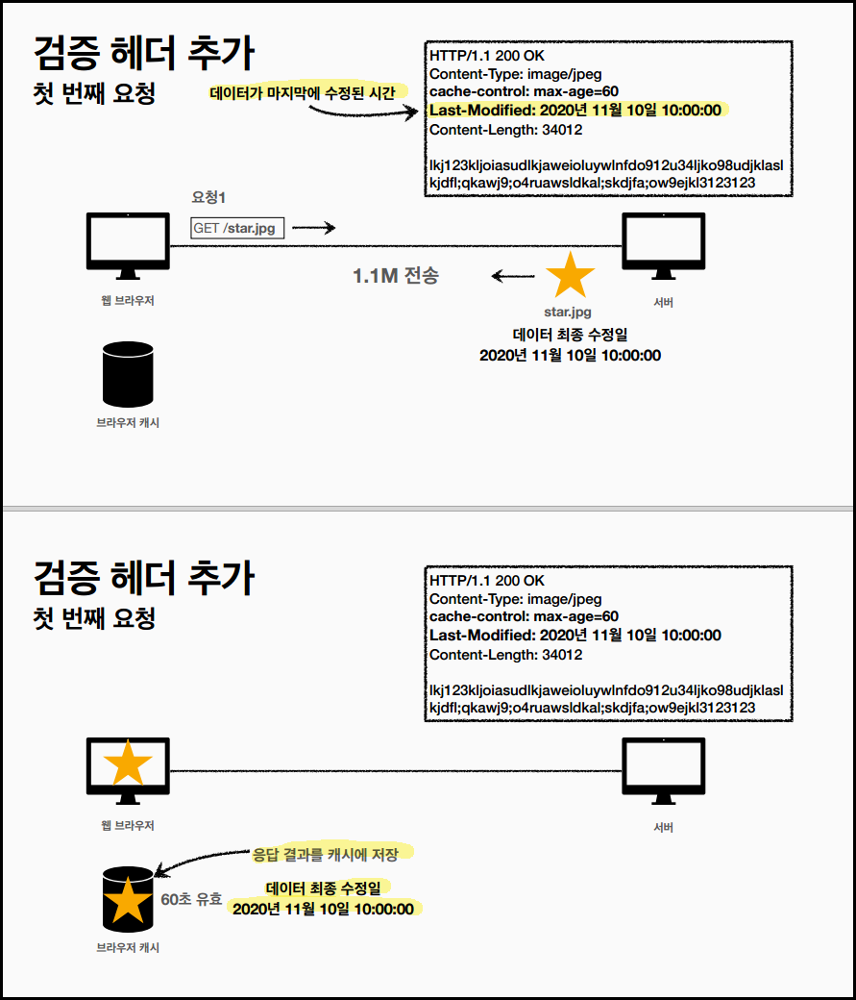
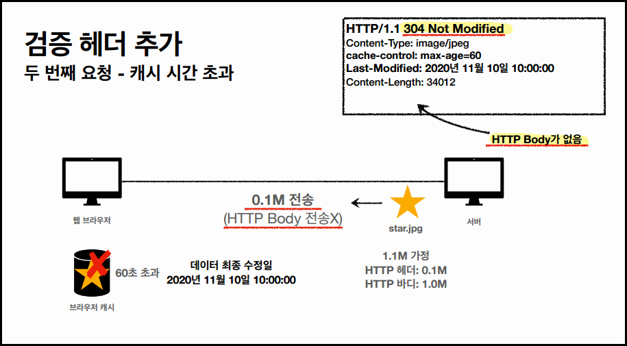
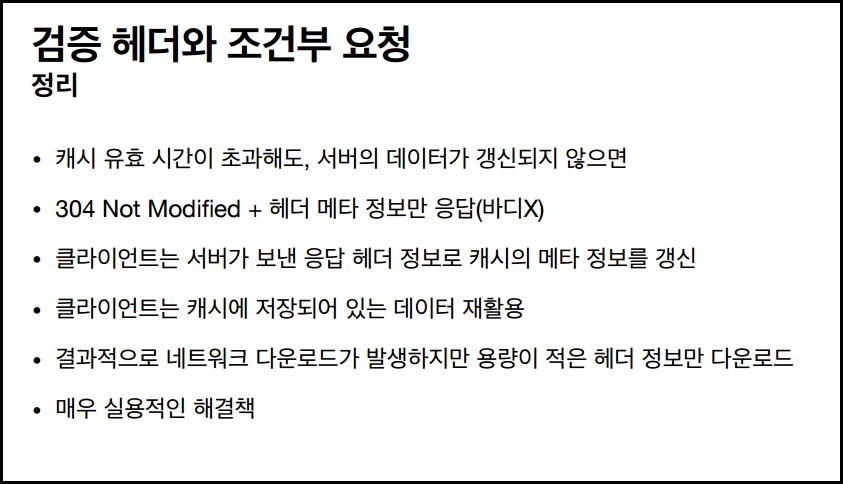
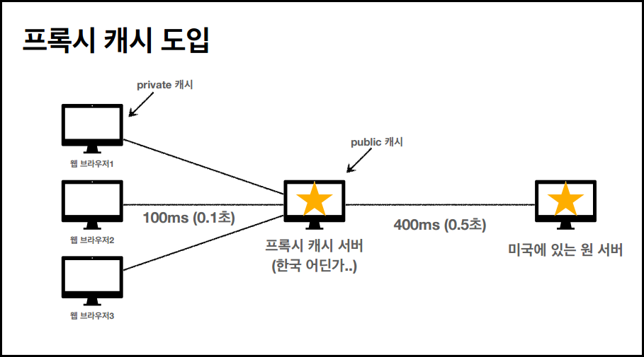
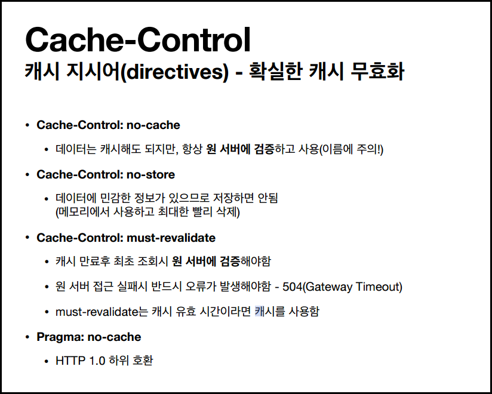
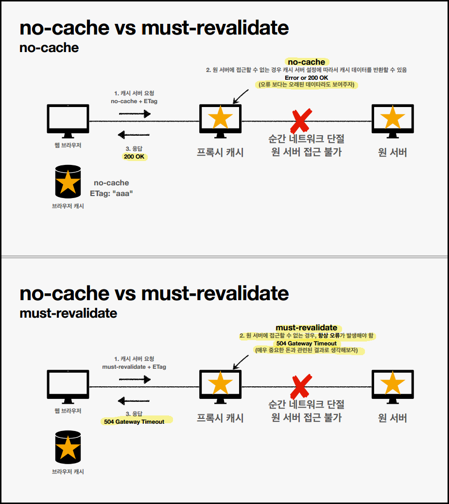

# HTTP 헤더 개요

### 헤더 분류

- General 헤더: 메시지 전체에 적용되는 정보
- Request 헤더: 요청 정보
- Response 헤더: 응답 정보
- Entity 헤더: 엔티티 바디 정보

> '엔티티(Entity)'라는 용어 대신, '표현(Representation)'으로 바뀜

### 표현 헤더

 

## 협상

### 협상과 우선순위 (Quality Values)

- 0~1 (클수록 높은 우선순위)
- 생략하면 1
- Accept-Language: ko-KR,ko;q=0.9,en-US;q=0.8,en;q=0.7
  (한국어 → 영어 순서대로 선호한다고 보내는 것임) 1. ko-KR;q=1 (q 생략) 2. ko;q=0.9 3. en-US;q=0.8 4. en:q=0.7

 

## 전송 방식

### 전송 방식 분류

1. 단순 전송
   - Content-Length: 3423
2. 압축 전송
   - Content-Encoding: gzip
3. 분할 전송
   - Transfer-Encoding: chunked
4. 범위 전송
   - Range, Content-Range

 

## 일반 정보

- `From`: 유저 에이전트의 이메일 정보
  - 일반적으로 잘 안쓰나, 검색 엔진 같은 곳에서 사용.
- `Referer`: 이전 웹페이지 주소 ★
  - 정말 많이 사용한다!
  - 유입 경로 분석 가능 (데이터 분석할 때 사용)
  - (참고: referer는 사실 오타고, referrer가 맞는 단어)
- `User-Agent`: 유저 에이전트 애플리케이션 정보
  - 클라이언트의 애플리케이션 정보
- `Server`: 요청을 처리하는 오리진 서버의 소프트웨어 정보
  - Server: Apache/2.2.22 (Debian)
  - 응답에서 사용
- `Date`: 메시지가 생성된 날짜
  - Date: Tue, 15 Nov 1994 08:12:31 GMT
  - 응답에서 사용 (과거엔 요청에서도 사용했으나, 최신 스펙에선 응답에서만)

 

## 특별한 정보

- `Host`: 요청한 호스트 정보(도메인) ★★★
  - 요청에서 사용하고, 필수!! 매우 중요함.
  - 하나의 서버가 여러 도메인을 처리해야 할 때.
- `Location`: 페이지 리다이렉션
  - 3xx 응답의 결과에 Location 헤더가 있으면, Location 위치로 자동 이동(리다이렉트)
- `Allow`: 허용 가능한 HTTP 메서드
  - 많이 구현되어 있지 않음. 참고만.
- `Retry-After`: 유저 에이전트가 다음 요청을 하기까지 기다려야 하는 시간
  - 503(Service Unavailable): 서비스가 언제까지 불능인지 알려줄 수 있음

 

## 인증 (Authorization)

- 클라이언트 인증 정보를 서버에 전달
- `WWW-Authenticate`
  - 401 Unauthorized 응답과 함께 사용

 

## 쿠키 ★★

2개의 헤더가 사용된다.

- `Set-Cookie`: 서버에서 클라이언트로 쿠키 전달(응답)
- `Cookie`: 클라이언트가 서버에서 받은 쿠키를 저장하고, HTTP 요청시 서버로 전달

Ex) 쿠키 미사용 시: 로그인 후에도 "안녕하세요, 손님"이라고 뜬다. "안녕하세요, ○○○님"이 아니라.

- HTTP는 무상태 프로토콜이다. 클라이언트와 서버가 요청과 응답을 주고받으면 연결이 끊어짐. (클라이언트와 서버는 서로 상태를 유지하지 않는다.)

- **사용처**
  - 사용자 로그인 세션 관리
  - 광고정보 트래킹
- **쿠키 정보는 항상 서버에 전송됨**
  - 네트워크 트래픽 추가 유발
  - 최소한의 정보만 사용
  - 서버에 전송하지 않고, 웹 브라우저 내부에 데이터를 저장하고 싶으면 '웹 스토리지' 참고
- **주의‼**
  - 보안에 민감한 데이터는 저장하면 안됨(주민번호, 신용카드 번호 등)
- **도메인을 명시할 수 있다.**
  - 명시: 명시한 문서 기준 도메인 + 서브 도메인까지 포함해서 전송됨
  - 도메인 생략 시: 현재 문서 기준 도메인만 적용됨
- **보안**
  - Secure
    - Secure를 사용하면 https인 경우에만 전송 (기존엔 http, https 구분하지 않고 전송)
  - HttpOnly
    - XSS 공격 방지
    - 자바스크립트에서 접근 불가(document.cookie)
    - HTTP 전송에만 사용
  - SameSite
    - XSRF 공격 방지
    - 요청 도메인과 쿠키에 설정된 도메인이 같은 경우만 쿠키 전송

 

# 캐시와 조건부 요청

### 캐시가 없을 때

- 데이터가 변경되지 않아도 계속 네트워크를 통해서 데이터를 다운로드 받아야한다.
- 인터넷 네트워크는 매우 느리고 비싸다.
- 브라우저 로딩 속도가 느리다.
- 느린 사용자 경험

- 웹 브라우저 내부에 캐시를 저장하는 캐시 저장소가 있음.

  

- 두 번째 요청 땐, 캐시를 먼저 뒤진다. 캐시 유효시간을 검증 후, '네트워크를 거치지 않고' 가져옴.

  ⇒ 브라우저 로딩 속도가 빠르다!! (빠른 사용자 경험)

  

### 캐시 시간 초과 시

- 서버를 통해 다시 조회하고, 캐시를 갱신한다.
- 이때 다시 네트워크 다운로드가 발생한다.

 

# 검증 헤더와 조건부 요청

> 만약! 클라이언트가 가진 데이터와 서버가 가진 데이터가 동일할 때. 굳이 다운로드를 다시 받을 필요가 있을까? ⇒ '검증 헤더'로 해결.

### 검증 헤더

- 캐시 데이터와 서버 데이터가 같은지 검증하는 데이터
- 종류: `Last-Modified`, `ETag`

### 조건부 요청 헤더

- 검증 헤더로 조건에 따른 분기
- `If-Modified-Since`: Last-Modified 사용
  - 이후에 데이터가 수정되었는가? 를 물어보는.
  - **데이터 미변경 시: 304 Not Modified,** 헤더 데이터만 전송(BODY 미포함). 전송 용량 0.1M
  - **데이터 변경 시: 200 OK**, 모든 데이터 전송(BODY 포함). 전송 용량 1.1M
- `If-None-Match`: ETag 사용
- 조건이 만족하면 200 OK
- 조건이 만족하지 않으면 304 Not Modified

- `**Last-Modified`, `If-Modified-Since`의 단점\*\*
  - 1초 미만 단위로 캐시 조정이 불가능
  - 날짜 기반의 로직 사용
  - 데이터를 수정해서 날짜가 다르지만, 같은 데이터를 수정해서 데이터 결과가 똑같은 경우
  - 서버에서 별도의 캐시 로직을 관리하고 싶은 경우
    (→ 이 방법으로 `ETag` 사용)
- `**ETag`, `If-None-Match`\*\*

  - ETag(Entity Tag)
  - 캐시용 데이터에 임의의 고유한 버전 이름을 달아둘 수 있음
    - ex) ETag: "v1.0", ETag: "a2fjfjwai3"
  - 데이터가 변경되면 이 이림을 바꾸어서 변경함(Hash를 다시 생성)
  - 진짜 단순하게 ETag만 보내서, 같으면 유지하고 다르면 다시 받기.
  - **캐시 제어 로직을 서버에서 완전히 관리**

    → 클라이언트는 단순히 값을 서버에 제공하며, 캐시 메커니즘을 모름.

 

- 데이터를 저장해 두었던 캐시를 재사용할 수 있으나, 클라이언트의 데이터와 서버의 데이터가 같다는 사실을 확인할 수 있는 방법이 필요하다.

  

- 캐시 시간이 초과한 상황, 위와 같이 `Last-Modified`가 있으면 아래와 같은 과정을 거친다.

  - 저장된 날짜 이후로 데이터가 변경되지 않았으면 , 서버에서 신선한(?) 데이터라고 판단해 그냥 쓰는걸로.
  - 그리고 `304 Not Modified` 발생 시, **HTTP Body가 없다**는 것이 매우 중요함.  
    ⇒ 네트워크 과부하가 확 줄기 때문!

        

- 네트워크 다운로드가 발생하긴 하지만, 0.1M (헤더 정보만) 다운받으면 된다는 아주 효율적인 상황이 발생.

  

 

# 캐시 제어 헤더

- Cache-Control: 캐시 제어 ★
- Pragma: 캐시 제어(HTTP 1.0 하위 호환. 지금은 거의 사용하지 않음)
- Expires: 캐시 유효 기간(하위 호환)
  - 캐시 만료일을 정확한 날짜로 지정 (지금은 더 유연한 max-age 사용 권장)
  - expires: Mon, 01 Jan 1990 00:00:00 GMT

### Cache-Control

- **Cache-Control: max-age**
  - 캐시 유효 시간, 초 단위 (보통 길게 잡음)
- **Cache-Control: no-cache**
  - 데이터는 캐시를 해도 되지만, 항상 원(origin) 서버에 검증하고 사용하라는 뜻.
    (중간에 있는 캐시서버 같은 곳 말고, 원 서버)
- **Cache-Control: no-store**
  - 데이터에 민감한 정보가 있으므로 저장하면 안됨 (보통 캐시는 하드디스크에 저장됨)
    (메모리에서 사용하고 최대한 빨리 삭제)

 

# 프록시 캐시

- 원 서버까지 가기엔 너무 멀다.

  

  ⇒ 이런거 덕분에 유튜브를 빠르게 볼 수 있는 것!!
  (사람들이 많이 보는 컨텐츠는 로딩 속도가 훨씬 빠르다. 한국 어딘가에 있는 서버에서 다운로드 받기 때문)

 

# 캐시 무효화

- 확실한 캐시 무효화를 할 수 있는 응답이 있다. 아래를 전부 넣어줘야 함.

  - Cache-Control: no-cache, no-store, must-revalidate
  - Pragma: no-cache
    - (HTTP 1.0 과거 브라우저에서 혹시 요청이 올 수도 있으니.)

  

- 원서버 접근 불가 시.

  - `no-cache`는 옛날 것이라도 보여주자 vs `must-revalidate`는 무조건 오류가 발생하도록.

    
