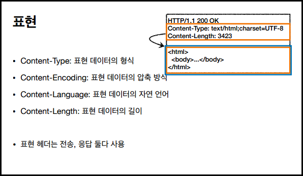

# HTTP 헤더 개요

### 헤더 분류

- General 헤더: 메시지 전체에 적용되는 정보
- Request 헤더: 요청 정보
- Response 헤더: 응답 정보
- Entity 헤더: 엔티티 바디 정보

> '엔티티(Entity)'라는 용어 대신, '표현(Representation)'으로 바뀜

### 표현 헤더

 

## 협상

### 협상과 우선순위 (Quality Values)

- 0~1 (클수록 높은 우선순위)
- 생략하면 1
- Accept-Language: ko-KR,ko;q=0.9,en-US;q=0.8,en;q=0.7
  (한국어 → 영어 순서대로 선호한다고 보내는 것임) 1. ko-KR;q=1 (q 생략) 2. ko;q=0.9 3. en-US;q=0.8 4. en:q=0.7

 

## 전송 방식

### 전송 방식 분류

1. 단순 전송
   - Content-Length: 3423
2. 압축 전송
   - Content-Encoding: gzip
3. 분할 전송
   - Transfer-Encoding: chunked
4. 범위 전송
   - Range, Content-Range

 

## 일반 정보

- `From`: 유저 에이전트의 이메일 정보
  - 일반적으로 잘 안쓰나, 검색 엔진 같은 곳에서 사용.
- `Referer`: 이전 웹페이지 주소 ★
  - 정말 많이 사용한다!
  - 유입 경로 분석 가능 (데이터 분석할 때 사용)
  - (참고: referer는 사실 오타고, referrer가 맞는 단어)
- `User-Agent`: 유저 에이전트 애플리케이션 정보
  - 클라이언트의 애플리케이션 정보
- `Server`: 요청을 처리하는 오리진 서버의 소프트웨어 정보
  - Server: Apache/2.2.22 (Debian)
  - 응답에서 사용
- `Date`: 메시지가 생성된 날짜
  - Date: Tue, 15 Nov 1994 08:12:31 GMT
  - 응답에서 사용 (과거엔 요청에서도 사용했으나, 최신 스펙에선 응답에서만)

 

## 특별한 정보

- `Host`: 요청한 호스트 정보(도메인) ★★★
  - 요청에서 사용하고, 필수!! 매우 중요함.
  - 하나의 서버가 여러 도메인을 처리해야 할 때.
- `Location`: 페이지 리다이렉션
  - 3xx 응답의 결과에 Location 헤더가 있으면, Location 위치로 자동 이동(리다이렉트)
- `Allow`: 허용 가능한 HTTP 메서드
  - 많이 구현되어 있지 않음. 참고만.
- `Retry-After`: 유저 에이전트가 다음 요청을 하기까지 기다려야 하는 시간
  - 503(Service Unavailable): 서비스가 언제까지 불능인지 알려줄 수 있음

 

## 인증 (Authorization)

- 클라이언트 인증 정보를 서버에 전달
- `WWW-Authenticate`
  - 401 Unauthorized 응답과 함께 사용

 

## 쿠키 ★★

2개의 헤더가 사용된다.

- `Set-Cookie`: 서버에서 클라이언트로 쿠키 전달(응답)
- `Cookie`: 클라이언트가 서버에서 받은 쿠키를 저장하고, HTTP 요청시 서버로 전달

Ex) 쿠키 미사용 시: 로그인 후에도 "안녕하세요, 손님"이라고 뜬다. "안녕하세요, ○○○님"이 아니라.

- HTTP는 무상태 프로토콜이다. 클라이언트와 서버가 요청과 응답을 주고받으면 연결이 끊어짐. (클라이언트와 서버는 서로 상태를 유지하지 않는다.)

- **사용처**
  - 사용자 로그인 세션 관리
  - 광고정보 트래킹
- **쿠키 정보는 항상 서버에 전송됨**
  - 네트워크 트래픽 추가 유발
  - 최소한의 정보만 사용
  - 서버에 전송하지 않고, 웹 브라우저 내부에 데이터를 저장하고 싶으면 '웹 스토리지' 참고
- **주의‼**
  - 보안에 민감한 데이터는 저장하면 안됨(주민번호, 신용카드 번호 등)
- **도메인을 명시할 수 있다.**
  - 명시: 명시한 문서 기준 도메인 + 서브 도메인까지 포함해서 전송됨
  - 도메인 생략 시: 현재 문서 기준 도메인만 적용됨
- **보안**
  - Secure
    - Secure를 사용하면 https인 경우에만 전송 (기존엔 http, https 구분하지 않고 전송)
  - HttpOnly
    - XSS 공격 방지
    - 자바스크립트에서 접근 불가(document.cookie)
    - HTTP 전송에만 사용
  - SameSite
    - XSRF 공격 방지
    - 요청 도메인과 쿠키에 설정된 도메인이 같은 경우만 쿠키 전송
