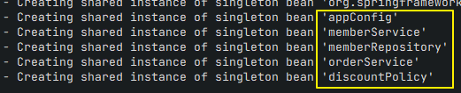
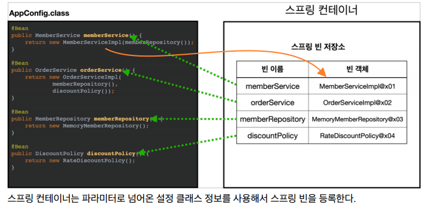

# 스프링 컨테이너와 스프링 빈

## 스프링으로 전환하기

- AppConfig 수정하기
  - `@Configuration`, `@Bean` 태그 추가됨.
- MemberApp에 스프링 컨테이너 적용

  - `ApplicationContext` : Spring은 다 이걸로 시작됨.

    `AnnotationConfigApplicationContext` : 인터페이스를 이걸로 구현.

    ```java
    ApplicationContext applicationContext =
    new AnnotationConfigApplicationContext(AppConfig.class);

    // 꺼내는 방법
    MemberService memberService =
    applicationContext.getBean("memberService", MemberService.class);	// ("이름", 반환타입)
    ```

- 콘솔창에서 실행시켜보면, AppConfig에서 스프링 컨테이너에 등록한 것들이 보인다.

  

<br>

### ✔ 스프링 컨테이너, 스프링 빈 ★★★

- `ApplicationContext`를 스프링 컨테이너라 한다. (그리고 '**인터페이스**'임)
- 기존에는 개발자가 `AppConfig` 를 사용해서 직접 객체를 생성하고 의존관계를 주입 했지만, 이제는 **스프링 컨테이너를 통해서** 사용한다.
- 스프링 컨테이너는 'XML 기반, 어노테이션 기반'으로 만들 수 있다.
- 스프링 컨테이너는 `@Configuration` 이 붙은 AppConfig 를 설정(혹은 구성) 정보로 사용한다.+`@Bean` **이라 적힌 메소드를 모두 호출해서 반환된 객체를 스프링 컨테이너에 등록한다.**
- 이처럼 스프링 컨테이너에 등록된 객체를 「**스프링 빈**」이라고 한다!!
- 스프링 빈은 `@Bean` 이 붙은 **메소드의 이름**을 스프링 빈의 이름으로 사용한다.
  (⇒ memberService, orderService )
- 스프링 빈은 `applicationContext.getBean()` 메서드를 사용해서 찾을 수 있다.

> 참고: 스프링 컨테이너는 `BeanFactory` , `ApplicationContext` 로 구분되어 있지만, BeanFactory는 거의 사용을 안하기에 일반적으로 ApplicationContext를 스프링 컨테이너라 함.

### ✔ 스프링 빈 등록

- AppConfig에서 `@Bean` 을 통해 등록해줬다.



<br>

> 💡 **주의** : 빈 이름은 **항상 다른 이름을 부여**해야 한다. 이름이 같으면, 다른 빈이 무시되거나 기존 빈을 덮어버리거나 설정에 따라 오류가 발생한다!

<br>

> 💡 **스프링 빈 등록 → 의존관계 주입(준비) → 의존관계 주입(완료)**

> 스프링은 빈을 생성하고, 의존관계를 주입하는 단계가 나누어져 있다. 그런데 이렇게 자바 코드로 스프링 빈을 등록하면 생성자를 호출하면서 의존관계 주입도 한번에 처리된다. 여기서는 이해를 돕기 위해 개념적으로 나누어 설명했다. (자세한 내용은 뒤에 `의존관계 자동주입` 에서 설명될 것임)

<br>

## 컨테이너에 등록된 스프링 빈 조회하기

❗ 테스트 코드로 짜볼 예정! (패키지 생성: hello.core.beanfind)

```java
// JUnit 5부턴 public 안써도 되서 지움.
class ApplicationContextInfoTest {

	AnnotationConfigApplicationContext ac = new AnnotationConfigApplicationContext(AppConfig.class);

	@Test
	@DisplayName("모든 빈 출력하기")
	void findAllBean() {
		String[] beanDefinitionNames = ac.getBeanDefinitionNames();
		for(String beanDefinitionName : beanDefinitionNames) {	// 이클립스에선 이 for문 생성 단축키 없나?
			Object bean = ac.getBean(beanDefinitionName);
			System.out.println("name = " + beanDefinitionName + ", object = " + bean);
		}
	}


	@Test
	@DisplayName("애플리케이션 빈 출력하기")		// 내가 등록한 것만 출력하고 싶어서.
	void findApplicationBean() {
		String[] beanDefinitionNames = ac.getBeanDefinitionNames();
		for(String beanDefinitionName : beanDefinitionNames) {
			BeanDefinition beanDefinition = ac.getBeanDefinition(beanDefinitionName);

			if(beanDefinition.getRole() == BeanDefinition.ROLE_APPLICATION) {
				Object bean = ac.getBean(beanDefinitionName);
				System.out.println("name = " + beanDefinitionName + ", object = " + bean);
			}

		}
	}
		//	ROLE_APPLICATION: 직접 내가 등록한 애플리케이션 빈
		//	ROLE_INFRASTRUCTURE: 스프링이 내부에서 사용하는 빈
}
```

- **모든 빈 출력하기**
  - `ac.getBeanDefinitionNames()` : 스프링에 등록된 모든 빈 이름을 조회한다.
  - `ac.getBean()` : 빈 이름으로 빈 객체(인스턴스)를 조회한다.
- **애플리케이션 빈 출력하기** (=내가 등록한 빈)
  - 스프링이 내부에서 사용하는 빈은 `getRole()` 로 구분할 수 있다.
  - `ROLE_APPLICATION` : **직접 내가 등록한** 애플리케이션 빈
  - `ROLE_INFRASTRUCTURE` : **스프링이 내부에서 사용하는 빈**

> 사실 위와 같이 모조리 조회할 일은 없음.

<Br>

## 스프링 빈 조회 - 기본, 동일한 타입 여러개

- 스프링 컨테이너에서 스프링 빈을 찾는 가장 기본적인 조회 방법
  - `ac.getBean(빈이름, 타입)`을 사용
  - `ac.getBean(타입)` ⇒ 이처럼 타입만 줘도 됨
- 그러나, 조회 대상 스프링 빈이 없으면 예외 발생.

> **Test는 반드시! 실패 테스트도 만들어야 한다.** ⭐

- 실패 테스트 (`assertThrows` 사용)

  ```java
  // 실패 테스트 만들기
  	@Test
  	@DisplayName("빈 이름으로 조회X")
  	void findBeanByNameX() {
  		// 실패 코드 작성.
  //		MemberService xxxx = ac.getBean("xxxx", MemberService.class);

  		// 무조건 이 예외가 터져야 성공한다는 코드 작성. (람다 활용)
  		org.junit.jupiter.api.Assertions.assertThrows(NoSuchBeanDefinitionException.class,
  				() -> ac.getBean("xxxx", MemberService.class));
  	}
  ```

- `ac.getBeansOfType()`을 사용해 해당 타입의 모든 빈을 조회할 수 있음

<br>

## 스프링 빈 조회 - 상속 관계 ⭐

---

⇒ 이게 중요함!

- 부모 타입으로 조회 시, 자식 타입도 다 끌려나옴.
  (→ `Object`로 조회 시, 모든 스프링 빈이 조회됨)

- 조회는 이정도 위주로 쓰는 편. (사실 빈을 조회할 일은 거의 없음.)

  ```java
  public class ApplicationContextExtendsFindTest {

  	AnnotationConfigApplicationContext ac = new AnnotationConfigApplicationContext(TestConfig.class);

  	// 테스트용 클래스 생성
  	@Configuration
  	static class TestConfig{
  		@Bean
  		public DiscountPolicy rateDiscountPolicy() {
  			return new RateDiscountPolicy();
  		}

  		@Bean
  		public DiscountPolicy fixDiscountPolicy() {
  			return new FixDiscountPolicy();
  		}
  	}

  	@Test
  	@DisplayName("부모 타입으로 조회 시, 자식이 둘 이상 있으면 중복 오류가 발생함")
  	void findBeanByParentTypeDuplicate() {
  //		DiscountPolicy bean = ac.getBean(DiscountPolicy.class);
  		org.junit.jupiter.api.Assertions.assertThrows(NoUniqueBeanDefinitionException.class,
  				() -> ac.getBean(DiscountPolicy.class));
  	}

  	@Test
  	@DisplayName("부모 타입으로 조회 시, 자식이 둘 이상 있으면 빈 이름을 지정하면 된다")
  	void findBeanByParentTypeBeanName() {
  		DiscountPolicy rateDiscountPolicy = ac.getBean("rateDiscountPolicy", DiscountPolicy.class);
  		Assertions.assertThat(rateDiscountPolicy).isInstanceOf(RateDiscountPolicy.class);
  	}

  	@Test
  	@DisplayName("부모 타입으로 모두 조회하기")
  	void findAllBeanByParentType() {
  		Map<String, DiscountPolicy> beansOfType = ac.getBeansOfType(DiscountPolicy.class);
  		Assertions.assertThat(beansOfType.size()).isEqualTo(2);
  		for(String key : beansOfType.keySet()) {
  			System.out.println("key = " + key + ", value = " + beansOfType.get(key));
  		}
  	}

  	@Test
  	@DisplayName("부모 타입으로 모두 조회하기 - Object타입")
  	void findAllBeanByObjectType() {
  		Map<String, Object> beansOfType = ac.getBeansOfType(Object.class);
  		for(String key : beansOfType.keySet()) {
  			System.out.println("key = " + key + ", value = " + beansOfType.get(key));
  		}
  	}

  }
  ```

<br>

## BeanFactory와 ApplicationContext

---


- **정리**
  - `ApplicationContext`는 `BeanFactory`의 기능을 상속받는다.
  - `ApplicationContext`는 빈 관리기능 + 편리한 부가 기능을 제공한다.
  - `BeanFactory`를 직접 사용할 일은 거의 없다.
    부가기능이 포함된 `ApplicationContext`를 사용한다.
    ⇒ `BeanFactory`나 `ApplicationContext`를 **스프링 컨테이너**라고 한다.

<br>

## 다양한 설정 형식 지원 - 자바코드, XML

- 깊이있게 알 필요는 없음. 이해 정도만.
  (최근에는 스프링 부트를 많이 사용하면서 XML기반의 설정은 잘 사용하지 않음)
- 하지만 아직 많은 레거시 프로젝트 들이 XML로 되어 있고, 또 XML을 사용하면
  **컴파일 없이 빈 설정 정보를 변경할 수 있는 장점**도 있으므로 한번쯤 배워두는 것도 괜찮다.
- 방법 : `GenericXmlApplicationContext`를 사용하면서 xml 설정 파일을 넘기면 된다.

> **이전에 자바 파일 AppConfig로 하는 방식은 `팩토리 메서드` 방식이라고 부른다.**

<br>

## 스프링 빈 설정 메타 정보 - BeanDefinition

(깊이있게 알면 좋으나, 굳이 몰라도 되는 내용. 그냥 교양이라 생각하고 듣자ㅋㅋ 예제 안만듦.)

스프링은 어떻게 다양한 설정 형식을 지원하는 것일까? 바로 `BeanDefinition` 이라는 추상화 덕분. 이정도만 이해하자!
