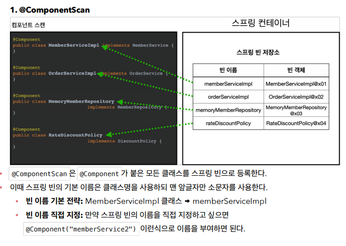
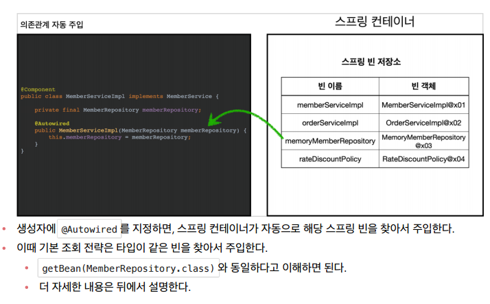

## 컴포넌트 스캔과 의존관계 자동 주입

- 키워드
  - `@Component`
  - `@Autowired`

등록해야 할 스프링 빈이 수십, 수백개가 되면 일일이 등록하기도 귀찮고, 설정 정보도 커지고, 누락하는 문제도 발생한다. 역시 개발자는 반복을 싫어한다. (무엇보다도, 귀찮다.)
➡ 스프링은 설정 정보가 없어도 자동으로 스프링 빈을 등록하는 **컴포넌트 스캔**이라는 기능을 제공함.
또 의존관계도 자동으로 주입하는 `@Autowired` 라는 기능도 제공한다.

- 기존 AppConfig는 냅두고, AutoAppConfig 클래스 생성

  - `ComponentScan`을 활용. 기존 AppConfig와 다르게, `@Bean`이 없다.
    (참고로, `@Configuration`안에 `@Component` 어노테이션이 있기 때문에, 이전 예제인 AppConfig가 자동 등록됨. → excludeFilters를 통해 예외해줌. 일반적으론 이렇게 제외하지 않는다‼)

    ```java
      @ComponentScan(
        excludeFilters = @ComponentScan.Filter(type = FilterType.ANNOTATION, classes = Configuration.class)
        )
    ```

- 이후, 구현체들(구현한 클래스들)에 가서 `@Component`를 붙여줌.
- 이제 의존관계 주입은 어떻게 하나❓
  ⇒ `Autowired`를 통해 자동 의존관계 주입. 생성자에 붙여줌.

  ```java
  // 생성자 (-> 생성자 주입 ★)
  @Autowired   // == ac.getBean(MemberRepository.class)
  public MemberServiceImpl(MemberRepository memberRepository) {
    super();
    this.memberRepository = memberRepository;
  }
  ```





<br>

## 탐색 위치와 기본 스캔 대상

- `basePackages` : 탐색할 패키지의 시작 위치를 지정한다. 이 패키지를 포함해서 하위 패키지를 모두 탐색한다.
  - `basePackages` = {"hello.core", "hello.service"} 이렇게 여러 시작 위치를 지정할 수도 있다.
- `basePackageClasses` : 지정한 클래스의 패키지를 탐색 시작 위치로 지정한다.
  - 만약 지정하지 않으면 `@ComponentScan` 이 붙은 설정 정보 클래스의 패키지가 시작 위치가 된다.

> 이걸 왜 쓰냐❓ ⇒ 모든 java 패키지를 다 스캔하기 때문에, 매우 오래걸림.

<br>

> 📌 **<권장하는 방법>** <br>
> 패키지 위치를 지정하지 않고, **설정 정보 클래스의 위치를 프로젝트 최상단에 두는 것.**
>
> > 지금 우리 프로젝트의 경우,
> > `hello.core` 여기에 `AppConfig` 파일을 생성한 후 `@ComponentScan` 애노테이션을 붙이는 것

> ✔ **참고**
> 스프링 부트를 사용하면 스프링 부트의 대표 시작 정보인 `@SpringBootApplication` 를 이 프로젝트 시작 루트 위치에 두는 것이 관례이다. (그리고 이 설정안에 바로 @ComponentScan 이 들어있다!)

<br>

### 컴포넌트 기본 스캔 대상

컴포넌트 스캔은 `@Component` 뿐만 아니라 다음과 내용도 추가로 대상에 포함.

- `@Component` : 컴포넌트 스캔에서 사용
- `@Controlller` : 스프링 MVC 컨트롤러로 인식
- `@Service` : 특별한 처리는 하지 않음. 대신, 개발자들이 '핵심 비즈니스 로직이 여기 있겠구나'라고 인식하는데 도움을 줌. ⇒ 스프링 비즈니스 로직에서 사용.
- `@Repository` : 스프링 데이터 접근 계층에서 사용
- `@Configuration` : 스프링 설정 정보에서 사용

<br>

## 중복 등록과 충돌

1. 자동 빈 등록 vs 자동 빈 등록
   ⇒ 보통 자동 빈 등록끼리 충돌 나는 일은 거의 없다.
   강제로 `@Component("name")` name 부분을 동일하게 만들어주면 충돌남.
2. 수동 빈 등록 vs 자동 빈 등록
   - 수동 빈이 자동 빈을 오버라이딩하게 됨. ⇒ **수동 빈이 우선권**을 가지게 된다. (로그를 잘 읽어보면 적혀있음)

> 사실 이런 케이스는 개발자가 의도해서 만들어지기보단, 설정이 꼬이고 꼬여 이런 버그가 만들어짐. 애매하고 잡기 어려운 버그.
> ⇒ 그렇기 때문에, 최근 Spring Boot에선 충돌 시 오류가 발생하도록 바뀜.

```
Consider renaming one of the beans or enabling overriding by setting spring.main.allow-bean-definition overriding=true
```

<br>

> 애매한 상황을 만들지 않는게 좋다. 어설픈 추상화나, 코드 줄이기를 하는 것보단 명확하게 코드를 짜는 것이 좋다.
