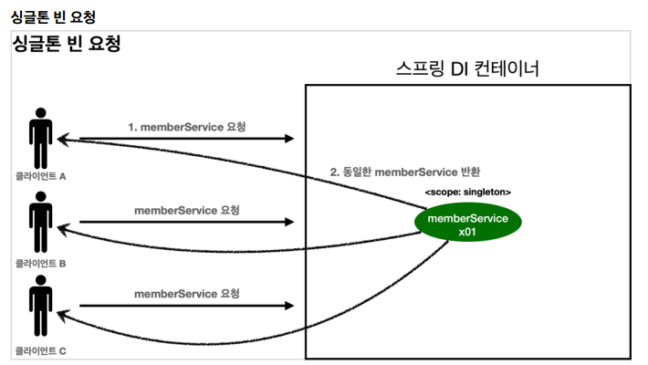
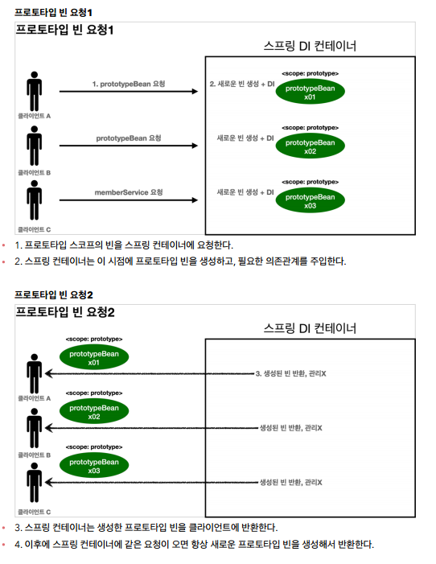

# 빈 스코프 ☆

### 스코프란?

스코프는 번역 그대로 빈이 존재할 수 있는 범위를 뜻함.

스프링은 다음과 같은 다양한 스코프를 지원한다.

- **싱글톤** : 기본 스코프**. 스프링 컨테이너의 시작과 종료까지 유지되는** 가장 넓은 범위의 스코프. 가장 생명주기가 길다.
- **프로토타입** : 스프링 컨테이너는 **프로토타입 빈의 생성과 의존관계 주입까지만 관여**하고 더는 관리하지 않는 매우 짧은 범위의 스코프.
- **웹 관련 스코프** : 스프링 웹과 관련된 기능이 들어가야 쓸 수 있는 스코프.
  - **request** : 웹 요청이 들어오고 나갈때까지 유지되는 스코프.
  - **session** : 웹 세션이 생성되고 종료될 때까지 유지되는 스코프.
  - **application** : 웹의 서블릿 컨텍스트와 같은 범위로 유지되는 스코프.

> 싱글톤, 프로토타입, request 정도 일단 숙지하자.

## 프로토타입 스코프

프로토타입 스코프를 스프링 컨테이너에 조회하면 스프링 컨테이너는 항상 새로운 인스턴스를 생성해서 반환한다.





> 💡 **여기서 핵심:** **스프링 컨테이너는 프로토타입 빈을 생성하고, 의존관계 주입, 초기화까지만 처리한다는 것이다.** 클라이언트에 빈을 반환하고, 이후 스프링 컨테이너는 생성된 프로토타입 빈을 관리하지 않는다. 프로토타입 빈을 관리할 책임은 프로토타입 빈을 받은 클라이언트에 있다. 그래서 `@PreDestory` 같은 종료 메서드가 호출되지 않는다.

🔽 예제 (test/../scope)

- 싱글톤 스코프

  ```java
  public class SingletonTest {

  	@Test
  	void singletonBeanFind() {
  		AnnotationConfigApplicationContext ac = new AnnotationConfigApplicationContext(SingletonBean.class);

  		SingletonBean singletonBean1 = ac.getBean(SingletonBean.class);
  		SingletonBean singletonBean2 = ac.getBean(SingletonBean.class);

  		// 둘이 동일한지 비교.
  		Assertions.assertThat(singletonBean1).isSameAs(singletonBean2);

  		ac.close();		// 이거 없으면 @PreDestory부분 실행 안됨.
  	}

  	@Scope("singleton")	  // 싱글톤은 default라 안써도 되긴 함.
  	static class SingletonBean{
  		@PostConstruct
  		public void init() {
  			System.out.println("싱글톤 빈.init");
  		}

  		@PreDestroy
  		public void destroy() {
  			System.out.println("싱글톤 빈.destroy");
  		}
  	}
  }
  ```

- 프로토타입 스코프

  ```java
  public class PrototypeTest {

  	@Test
  	void prototypeBeanFind() {
  		AnnotationConfigApplicationContext ac = new AnnotationConfigApplicationContext(PrototypeBean.class);

  		System.out.println("find prototypeBean1");
  		PrototypeBean prototypeBean1 = ac.getBean(PrototypeBean.class);  // 이때!(조회할 때) 초기화 메서드가 실행됨.
  		System.out.println("find prototypeBean2");
  		PrototypeBean prototypeBean2 = ac.getBean(PrototypeBean.class);
  		System.out.println("prototypeBean1 = " + prototypeBean1);
  		System.out.println("prototypeBean2 = " + prototypeBean2);

  		Assertions.assertThat(prototypeBean1).isNotSameAs(prototypeBean2);

  		ac.close();		//  싱글톤과는 다르게 @PreDestroy가 안됨. prototype은 그냥 버려지기 때문.
  	}

  	@Scope("prototype")
  	static class PrototypeBean{
  		@PostConstruct
  		public void init() {
  			System.out.println("프로토타입 빈.init");
  		}

  		@PreDestroy
  		public void destroy() {
  			System.out.println("프토로타입 빈.destroy");
  		}
  	}
  }
  ```

### **프로토타입 빈의 특징 정리**

- 스프링 컨테이너에 **요청할 때마다 새로 생성**된다.
- **스프링 컨테이너는 프로토타입 빈의 생성과 의존관계 주입 그리고 초기화까지만 관여**한다.
- 종료 메서드가 호출되지 않는다. (⇒ 필요하면 직접 수동으로 해주면 된다.)
- 그래서 프로토타입 빈은 프로토타입 빈을 조회한 클라이언트가 관리해야 한다.종료 메서드에 대한 호출도 클라이언트가 직접 해야한다.

<br>

## 프로토타입 스코프와 싱글톤 빈을 함께 사용할 때의 문제점

> 💡 의존관계를 외부에서 주입(DI) 받는게 아니라, 이렇게 직접 필요한 의존관계를 찾는 것을 **Dependency Lookup (DL): '의존관계 조회(탐색)**'이라고 한다.

### ObjectProvider로 해결

<br>

## 웹 스코프 ☆

- **웹 스코프 특징**
  - 웹 스코프는 **웹 환경에서만 동작**함
  - 웹 스코프는 프로토타입과 다르게 **스프링이 해당 스코프의 종료시점까지 관리**함. 따라서 종료 메서드가 호출됨
- **웹 스코프 종류**

  - **request** : **HTTP 요청 하나**가 들어오고 나갈 때 까지 유지되는 스코프, 각각의 HTTP 요청마다 별도의 빈 인스턴스가 생성되고, 관리된다.
  - **session** : HTTP Session과 동일한 생명주기를 가지는 스코프
  - **application** : 서블릿 컨텍스트( `ServletContext` )와 동일한 생명주기를 가지는 스코프
  - **websocket** : 웹 소켓과 동일한 생명주기를 가지는 스코프

- **아래 라이브러리를 추가해줘야 한다 ★**

  ```xml
  //web 라이브러리 추가
  implementation 'org.springframework.boot:spring-boot-starter-web'
  ```

  ⇒ 스프링부트가 내장 톰캣서버를 실행해줌.

> 📌 참고 : 스프링 부트는 웹 라이브러리가 없으면 우리가 지금까지 학습한 `AnnotationConfigApplicationContext`를 기반으로 애플리케이션을 구동한다. 웹 라이브러리가 추가되면 웹과 관련된 추가 설정과 환경들이 필요하므로 `AnnotationConfigServletWebServerApplicationContext`를 기반으로 애플리케이션을 구동한다.

- 만약 8080포트 사용 중이라 충돌난다면? 9090포트로 바꿔서 열어주자.

```xml
<!-- main/resources/application.properties -->

server.port = 9090
```

<br>

### request 스코프 예제 개발

만약 동시에 여러 HTTP 요청이 오면 정확히 어떤 요청이 남긴 로그인지 구분하기 어려워진다. 이럴때 사용하기 딱 좋은것이 바로 **request 스코프.**

- 기대하는 공통 포멧: `[UUID][requestURL]{message}`
- UUID를 사용해 HTTP 요청을 구분하자.
- requestURL 정보도 추가로 넣어, 어떤 URL을 요청해서 남은 로그인지 확인하자.

🔽 예제: hello.core.common 패키지

```java
@Component
@Scope(value = "request")   // value 빼도 되긴 함
public class MyLogger {

	private String uuid;
	private String requestURL;

	// requestURL만 setter 생성
	public void setRequestURL(String requestURL) {
		this.requestURL = requestURL;
	}

	// 기대하는 공통 포멧: [UUID][requestURL]{message}
	public void log(String message) {
		System.out.println("[" + uuid + "]" + "[" + requestURL + "] " + message);
	}

	@PostConstruct
	public void init() {
		String uuid = UUID.randomUUID().toString();	// java에 있는 UUID로 만들면, 유니크한 ID가 생성됨. (겹칠확률 로또당첨x10)
		System.out.println("[" + uuid + "] request scope bean create: " + this);
	}

	@PreDestroy
	public void close(){
		System.out.println("[" + uuid + "] request scope bean close: " + this);

	}

}
```

🔽 Controller 생성 (예제: hello.core.common)

```java
@Controller
@RequiredArgsConstructor   // lombok 기능. 생성자에 자동으로 주입됨.
public class LogDemoController {

	private final LogDemoService logDemoService;
	private final MyLogger myLogger;

	@RequestMapping("log-demo")
	@ResponseBody      // 이것의 역할은??
	public String logDemo(HttpServletRequest request) {
		String requestURL = request.getRequestURL().toString();  // 고객이 어떤 url로 요청했는지 알 수 있음.
		myLogger.setRequestURL(requestURL);

		myLogger.log("controller test");
		logDemoService.logic("testId");

		return "OK";
	}

}
```

**⇒ 오류가 난다.**

스프링 애플리케이션을 실행하는 시점에 싱글톤 빈은 생성해서 주입이 가능하지만, request 스코프 빈은 아직 생성되지 않는다. **이 빈은 실제 고객의 요청이 와야 생성할 수 있다.**

- **해결방안**
  1. `Provider`의 사용
  2. 프록시 사용
