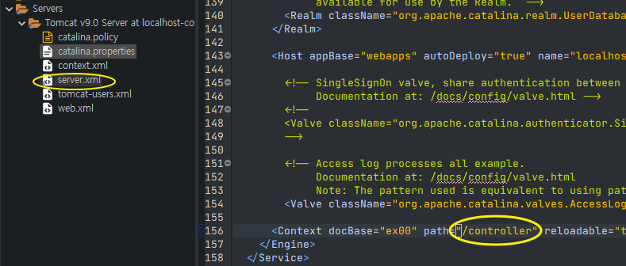

## Test 관련 어노테이션

- `@ContextConfiguration`
  - 스프링이 실행되면서 어떤 설정 정보를 읽어들여야 하는지를 명시함.
  - 스프링 내에 객체로 등록해줌. (스프링의 빈으로 등록된다)
    (→ 김영한님 강의에서, ApplicationContext 클래스와 비슷한 듯?)
  - `classpath:`나 `file:`을 사용할 수 있다.
- `@RunWith`
  - 현재 테스트 코드가 스프링을 실행하는 역할을 할 것이란 걸 명시.
- `@Log4j`
  - 롬복 어노테이션. (역할에 대해 정리하자 📌)
  - > _❓ `log`가 System.out.println과 같은 역할을 해주는데. 차이는? (참고로 롬복 제공기능)_

 

## url 경로 변경하기 (패키지명을 없애고, /로 통일)

- Servers → Tomcat → server.xml 을 열고 아래 적힌 패키지 경로를 지워주면 된다.

  
