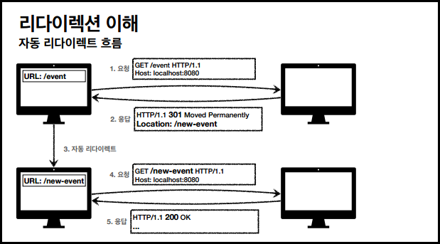
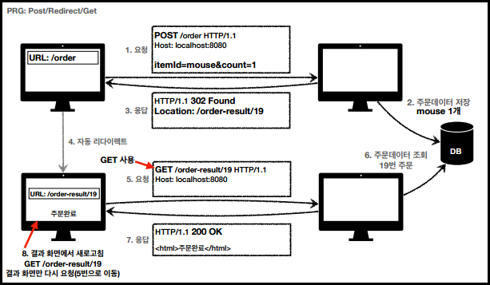
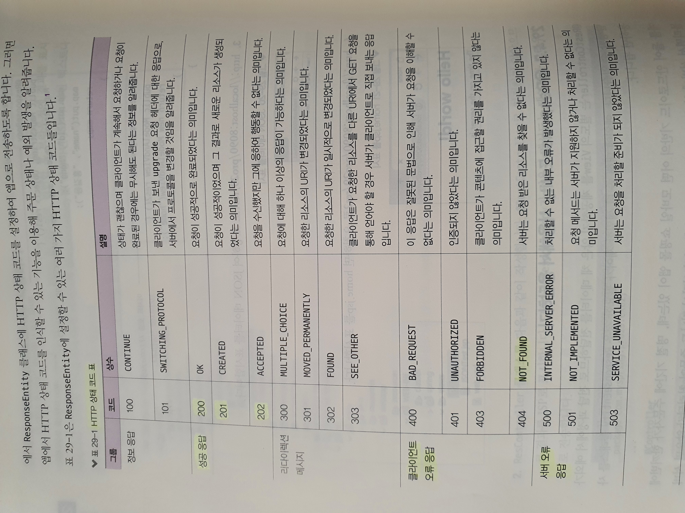

# HTTP 상태코드

크게 5가지로 나누어진다.

- 1xx (Informational): 요청이 수신되어 처리중 (거의 사용되지 않음)
- 2xx (Successful): 요청 정상 처리 (200 OK, 201 Created 등)
- 3xx (Redirection): 요청을 완료하려면 추가 행동이 필요
- 4xx (Client Error): 클라이언트 오류, 잘못된 문법 등으로 서버가 요청을 수행할 수 없음
- 5xx (Server Error): 서버 오류, 서버가 정상 요청을 처리하지 못함

 

## 2xx - 성공

- 200 OK
- 201 Created
- 202 Accepted
  - 요청이 접수는 되었으나, 처리가 완료되지 않았음 (잘 안씀)
- 204 No Content
  - 서버가 요청을 성공적으로 수행했으나, 응답 페이로드 본문에 보낼 데이터가 없는 상태
  - 예) save버튼. 이에 대한 결과로 data를 받을 필요가 없음. 같은 화면 유지되어야 함.

> 200, 201 정도를 많이 사용하는 편임.

 

## 3xx - 리다이렉션

서버가 클라이언트한테 다시 보냄. 요청을 완료하기 위해 추가 조치가 필요한 상황.

웹 브라우저는 3xx 응답의 결과에 Location 헤더가 있으면, Location 위치로 자동 이동 (리다이렉트)

- 300 Multiple Choices (안씀)
- 301 Moved Permanently
- 302 Found
- 303 See Other
- 304 Not Modified (은근 많이씀)
  - 캐시를 목적으로 사용
  - 클라이언트에게 리소스가 수정되지 않았음을 알려줌 → 클라이언트는 로컬PC에 저장된 캐시를 재사용한다. (캐시로 리다이렉트함)
- 307 Temporary Redirect
- 308 Permanent Redirect

### 리다이렉션의 종류

1. **영구 리다이렉션 (301, 308)**
   - 특정 리소스의 URI가 영구적으로 이동
   - 원래의 URL을 사용X, 검색 엔진 등에서도 변경 인지
   - 예) /members → /users
   - **301 Moved Permanently**
     - 리다이렉트 시 요청 메서드가 GET으로 변하고, 본문이 제거될 수 있음
   - **308 Permanet Rediect** (실무에서 잘 안씀)
     - 301과 기능은 같으나, 리다이렉트 시 요청 메서드와 본문 유지
       (처음 POST를 보내면 리다이렉트도 POST 유지)
2. **일시 리다이렉션 (302, 307, 303 → 3가지가 기능이 다 같음) ★**

   - 실무에서 많이 사용함!
   - 일시적인 변경 (ex - 주문 완료 후 주문 내역 화면으로 이동)
   - **PRG: Post/Redirect/Get**

     - 예) 주문 중에 실수로 새로고침 했을 때, 중복주문되는 것을 방지할 수 있음.

       

       - URL이 이미 POST → GET으로 리다이렉트 됨. 새로고침을 해도 GET으로 결과 화면만 조회된다.

   - **302 Found**
     - 리다이렉트 시 요청 메서드가 GET으로 변하고, 본문이 제거될 수 있음 (MAY)
     - 명확하지 않다는 단점이 있으나, 실무에서 많이 사용하고 크게 문제는 없는 편.
   - **307 Temporary Redirect**
     - 302와 기능은 같으나, 리다이렉트 시 요청 메서드와 본문 유지 (요청 메서드를 변경하면 안됨. MUST NOT)
   - **303 See Other**
     - 302와 기능은 같음. 리다이렉트 시 요청 메서드가 GET으로 변경.

3. **특수 리다이렉션**

 

## 4xx - 클라이언트 오류 / 5xx- 서버 오류

### 4xx (Client Error)

- 클라이언트의 요청에 잘못된 문법 등으로 서버가 요청을 수행할 수 없음
- **오류의 원인이 클라이언트에게 있다!**
- **400 Bad Request**
  - 요청 구문, 메시지 등의 오류. 클라이언트는 요청 내용을 다시 검토하고 보내야 함.
  - 예) 요청 파라미터가 잘못되었거나, API 스펙이 맞지 않을 때.
- **401 Unauthorized**
  - 인증이 되지 않음
- **403 Forbidden**
  - 서버가 요청을 이해했지만 승인을 거부함
  - 주로 인증 자격 증명은 있지만, 접근 권한이 불충분한 경우
- **404 Not Found**
  - 요청 리소스를 찾을 수 없음

### 5xx (Server Error)

- 서버 내부 문제로 오류 발생. (서버 문제이니 재시도하면 성공할 수도 있음)
- 웬만하면 500대 오류를 만들면 안됨. 진짜 서버에 문제가 있을 때에만.
- **500 Internal Server Error**
  - 서버 내부 문제로 오류 발생. 애매하면 500 오류.
- **503 Service Unavailable**

  - 서비스 이용 불가. 서버가 일시적인 과부하 등에 걸릴 시.

  

- 「자바 웹을 다루는 기술」 책 참고

  
