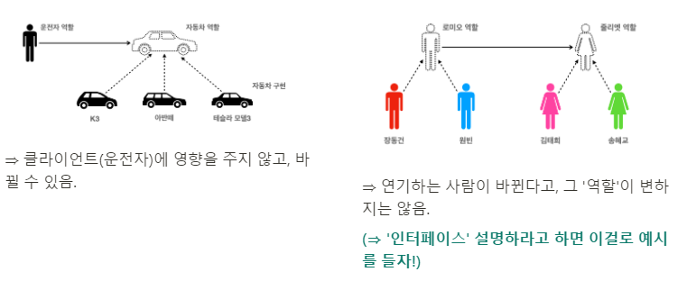
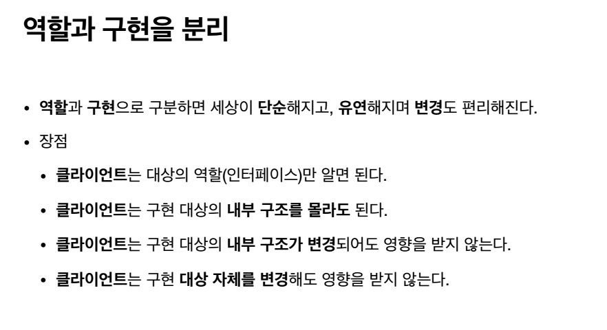
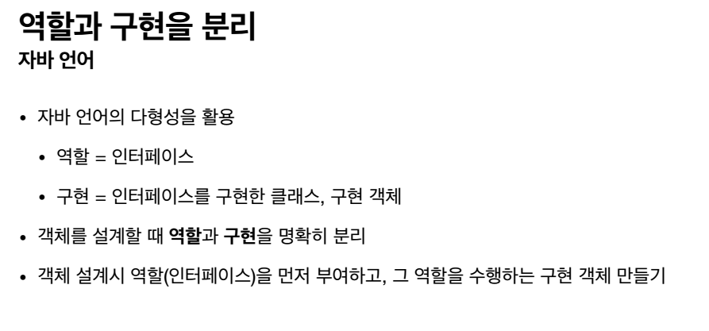
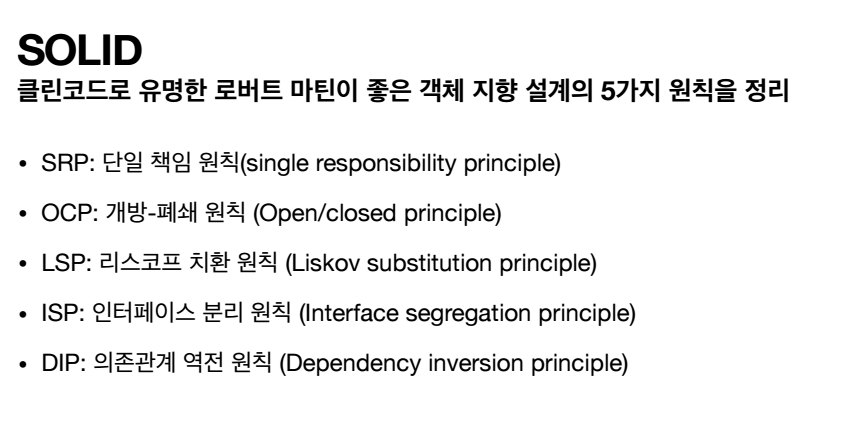
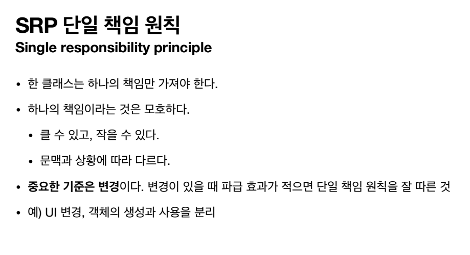
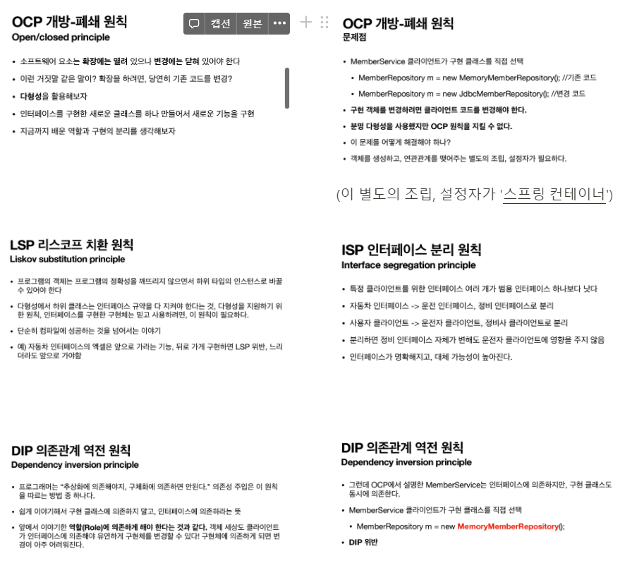
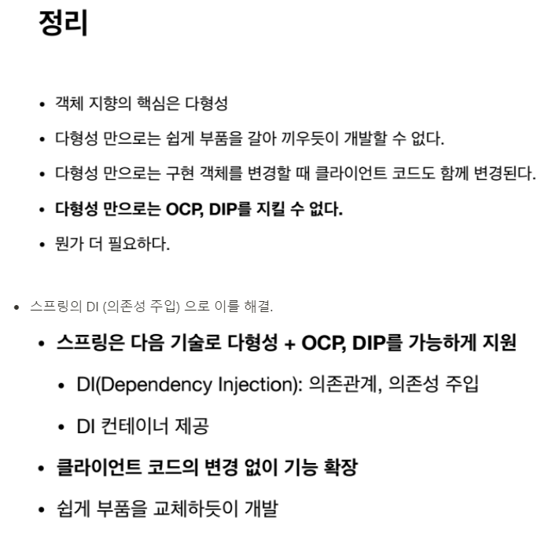

## 스프링의 핵심 컨셉

핵심 컨셉에 대해 제대로 이해하고 사용해야 이렇게 쓸 수 있는 것임. API 사용법만 안다고 잘 쓰는 것이 아님.

why? 대체 왜 열광하며 만들었을까?

- 스프링의 핵심은 '**객체 지향**'. 좋은 객체 지향 애플리케이션을 개발할 수 있게 도와주는 프레임워크. (자바 언어의 가장 큰 특징을 잘 살려내는 방식으로 돌아가길 원했기 때문.)

 

## 객체 지향 프로그래밍

- 객체 지향 프로그래밍이란?

  > 객체 지향 프로그래밍은 컴퓨터 프로그램을 명령어의 목록으로 보는 시각에서 벗어나 여러개의 독립된 단위, 즉 "객체"들의 **모임**으로 파악하고자 하는 것이다. 각각의 객체는 메시지를 주고받고, 데이터를 처리할 수 있다. **(협력)**

  > 레고 블럭 조립하듯이 / 키보드, 마우스 갈아끼듯이 / 컴퓨터 부품 갈아끼듯이, 컴포넌트를 쉽고 유연하게 변경하면서 개발할 수 있는 방법임. **⇒ 다형성**

## 다형성 ⭐

- **객체 지향의 꽃!!** (스프링은 다형성을 극대화해서 이용할 수 있게 도와줌. 어쩌면 이게 전부임.)

- **'역할 / 구현'의 분리** : 역할은 '인터페이스', 구현은 '클래스'.

> 객체를 설계할 때, **역할**과 **구현**을 명확히 분리해 설계해야 함. (역할이 더 중요. 역할이 먼저임)   **⇒ 인터페이스를 안정적으로 설계하는 것이 매우 중요!!**

> 💡 **핵심은 '클라이언트'. 클라이언트는 '인터페이스(역할)'만 알면 됨!!**

 

 

## 좋은 객체 지향 설계의 5가지 원칙 (SOLID) ⭐⭐

- **OCP, DIP가 제일 중요!!**

 

## 정리

spring이 대표적인 java framework로 자리 잡게 된 것은 아래와 같은 강력한 장점을 지니고 있기 때문이었다.

- **경량 컨테이너**
- **IoC (Invertion of Control: 제어 역행)**
- **DI (Dependency Injection: 의존성 주입)**
- **AOP (Aspect-Oriented Programming: 관점지향 프로그래밍)**

 
spring boot는 환경 설정을 최소화해주어 (사용자가 해야 할 부분을 대부분 spring boot가 해준다.) 개발자가 비즈니스 로직에 집중할 수 있도록 도와주어 생산성을 크게 향상한다.
  
하지만 간혹 Spring Boot가 Spring framework와 전혀 다른 새로운 기술이라고 오해하는 사람들이 있다. 그래서 spring에 관한 공부를 spring boot로 시작하는 경우가 종종 있는데, 이는 잘못된 사실이다. 아마 spring boot에 관하여 서치를 하다 보면 "스프링 부트 공부하기 전에 스프링부터 공부하세요"라는 말을 종종 볼 수 있었을 것이다. 왜냐하면 스프링 부트는 스프링 프레임워크라는 큰 틀에 속하는 도구이기 때문이다. 때문에 반드시 spring framework를 먼저 공부하는 것이 정도는 아니지만, 둘의 관계를 이해하고 공부하는 것이 중요하다.

  

> 하지만 인터페이스를 도입하면 추상화라는 비용이 발생한다.   기능을 확장할 가능성이 없다면, 구체 클래스를 직접 사용하고, 향후 꼭 필요할 때 리팩토링해서 인터페이스를 도입하는 것도 방법이다.
