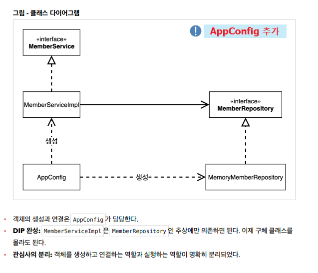

## 예제 만들기

- Test 코드

  - `MemberServiceTest.java` : `MemberApp.java` 대신, JUnit 활용해 테스트할 것임. (코드는 거의 비슷)

  - `단위 테스트` : Spring 등의 도움이 없이, 순수하게 Java 코드만으로 테스트를 하는 것 (이걸 잘 짜야함!)

역할들의 협력 관계를 그대로 재사용 할 수 있다!! (클라이언트의 요구사항이 변경되어 다른 클래스를 만들게 되더라도)

→ 「객체지향의 사실과 오해」라는 책의 핵심임.

- 역할과 구현을 잘 분리했음.
- 현재 '정액할인정책'으로 구현했음. But, 과연 '정률할인정책'으로 깔끔하게 바꿀 수 있는가?

<br>

## 객체 지향 원리 적용

⇒ 새로운 할인 정책을 개발해야 되는 상황임!

- Spring Container의 탄생 이유를 확인할 수 있음.

- [RateDiscountPolicy.java](http://ratediscountpolicy.java) 클래스 새로 추가 (인터페이스를 구현하는)
- 이후,

```java
public class OrderServiceImpl implements OrderService {

//	private final DiscountPolicy discountPolicy = new FixDiscountPolicy();
	private final DiscountPolicy discountPolicy = new RateDiscountPolicy();		// 할인 정책이 변경됨.
```

→ 이렇게 객체만 다른 클래스로 바꿔주면 끝. But,

- 여기서 문제! **DIP 위반** ⇒ 추상 의존: `DiscountPolicy` , 구현 클래스 의존: `RateDiscountPolicy`
- **OCP 위반** ⇒ 할인정책을 바꾸는 순간, `OrderServiceImpl`의 코드를 바꿔야하는 상황인 것임.

```java
// private final DiscountPolicy discountPolicy = new RateDiscountPolicy();

private DiscountPolicy discountPolicy;	// 1) 인터페이스에만 의존하도록 변경
```

<br>

### 관심사의 분리 ★★★ ( ⇒ AppConfig)

애플리케이션을 하나의 공연이라 생각해보자. 각각의 인터페이스를 배역(배우 역할)이라 생각하자.
<br>
그런데! 실제 배역 맞는 배우를 선택하는 것은 누가 하는가?
<br>
로미오와 줄리엣 공연을 하면 로미오 역할을 누가 할지 줄리엣 역할을 누가 할지는 배우들이 정하는게 아니다.
<br>
이전 코드는 마치 로미오 역할(인터페이스)을 하는 레오나르도 디카프리오(구현체, 배우)가 줄리엣 역할(인터페이스)을 하는 여자 주인공(구현체, 배우)을 직접 초빙하는 것과 같다.
<br>
디카프리오는 공연도 해야하고동시에 여자 주인공도 공연에 직접 초빙해야 하는 다양한 책임을 가지고 있다.
<br>
관심사를 분리하자.
<br>
배우는 본인의 역할인 배역을 수행하는 것에만 집중해야 한다.
<br>
디카프리오는 어떤 여자 주인공이 선택되더라도 똑같이 공연을 할 수 있어야 한다.
<br>
공연을 구성하고, 담당 배우를 섭외하고, 역할에 맞는 배우를 지정하는 책임을 담당하는 별도의 **공연 기획자**가 나올 시점이다.
<br>
공연 기획자를 만들고, 배우와 공연 기획자의 책임을 확실히 분리하자.

⇒ **AppConfig** 등장 (공연기획자 역할을 할 것임. 배우 섭외하고 이런거. 배우(구현한 Impl클래스)는 자신의 역할에만 집중.)



<br>

- '**생성자 주입'** 활용
- AppConfig

  ```java
  // 실제 동작에 필요한 '구현 객체를 생성'해주는 역할. ('객체의 생성과 연결' 담당)
  public class AppConfig {

  	public MemberService memberService() {
  		return new MemberServiceImpl(new MemoryMemberRepository());
  	}

  	public OrderService orderService() {
  		return new OrderServiceImpl(new MemoryMemberRepository(), new FixDiscountPolicy());
  	}

  }
  ```

- OrderServiceImpl

  ```java
  public class OrderServiceImpl implements OrderService {

  //	private final MemberRepository memberRepository = new MemoryMemberRepository();

  //	private final DiscountPolicy discountPolicy = new FixDiscountPolicy();
  //	private final DiscountPolicy discountPolicy = new RateDiscountPolicy();		// 할인 정책이 변경됨.

  	// 1) 인터페이스에만 의존하도록 변경
  	private MemberRepository memberRepository;
  	private DiscountPolicy discountPolicy;

  	// 2) 생성자 생성 (for 생성자 주입. AppConfig에서)
  	public OrderServiceImpl(MemberRepository memberRepository, DiscountPolicy discountPolicy) {
  		super();
  		this.memberRepository = memberRepository;
  		this.discountPolicy = discountPolicy;
  	}
  ```

- MemberApp 변경

  ```java
  //		MemberService memberService = new MemberServiceImpl();		// 기존에 쓴 방식.

  		AppConfig appConfig = new AppConfig();
  		MemberService memberService = appConfig.memberService();
  ```

- OrderApp도 똑같이 변경

  ```java
  //		MemberService memberService = new MemberServiceImpl();
  //		OrderService orderService = new OrderServiceImpl();

  		AppConfig appConfig = new AppConfig();
  		MemberService memberService = appConfig.memberService();
  		OrderService orderService = appConfig.orderService();
  ```

- Test코드도 수정 (차이점 : `@BeforeEach` 사용)

  ```java
  //	MemberService memberService = new MemberServiceImpl();
  	MemberService memberService;

  	@BeforeEach
  	public void beforeEach() {
  		AppConfig appConfig = new AppConfig();
  		memberService = appConfig.memberService();
  	}
  ```

AppConfig를 통한 관심사의 분리 → DIP 만족

- **AppConfig 리팩토링**

  - 기존

    ```java
    public class AppConfig {

    	public MemberService memberService() {
    		return new MemberServiceImpl(new MemoryMemberRepository());
    	}

    	public OrderService orderService() {
    		return new OrderServiceImpl(new MemoryMemberRepository(), new FixDiscountPolicy());
    	}

    }
    ```

  - 일단, new MemoryMemberRepository()가 중복 → 중복제거.

    ```java
    public class AppConfig {
    	// 이렇게 리팩토링 해주면, 설계에 대한 그림이 그대로 드러난다. (각 역할들이 모두 드러남.)

    	public MemberService memberService() {
    		return new MemberServiceImpl(memberRepository());
    	}

    	public OrderService orderService() {
    		return new OrderServiceImpl(memberRepository(), discountPolicy());
    	}

    	public DiscountPolicy discountPolicy() {
    		//		return new FixDiscountPolicy();
    		return new RateDiscountPolicy();		// 할인정책의 변경. 이거 하나만 이렇게 바꿔주면 끝.
    	}

    	private MemberRepository memberRepository() {
    		return new MemoryMemberRepository();
    	}

    }
    ```

    다른 구현체로 변경하고 싶으면, 여기서 하나만 바꿔주면 끝! / **사용영역에 있는 코드는 전혀 건드릴 필요가 없다!!**

    → AppConfig를 보면 역할, 구현 클래스가 한눈에 들어옴. (전체 구성이 어떻게 되어있는지 빠르게 파악 가능)

<br>

## IoC, DI, 그리고 컨테이너

### 제어의 역전 IoC(Inversion of Control)

(Spring에만 국한된 용어는 아님)

보통 기존의 프로그램은 클라이언트 구현 객체가 스스로 객체를 생성, 연결, 실행하는 즉 프로그램의 제어 흐름을 스스로 조종했다.

그러나 이전에 우리가 만든 **AppConfig**가 등장한 이후론, 구현 객체는 다른 건 신경쓰지 않고 오직 **자신의 역할만 실행한다.** (제어 흐름 권한을 AppConfig가 가짐)

이와 같이, 내가 호출하는 것이 아닌 프레임워크 같은 것들이 대신 호출을 해주는 것, **프로그램의 제어 흐름을 직접 제어하는 것이 아니라 외부에서 관리하는 것.** 이것을 **_제어권이 뒤바뀐다_**는 의미로 **`제어의 역전`**이라고 한다.

> **프레임워크와 라이브러리** 💡 <br> >**`프레임워크`** : 내가 작성한 코드를 제어하고, 대신 실행한다면 그것은 프레임워크 (JUnit) <br> >**`라이브러리`** : 내가 작성한 코드가 직접 제어와 흐름을 담당한다면 그것은 라이브러리

[ ] 이 둘의 차이점은 좀 더 확실히 정리해두는게 좋을 듯.

<br>

### ✔️ 의존관계 주입 DI (Dependency Injection)

- 의존관계는 **`정적`인 클래스 의존 관계**와, 실행 시점에 결정되는 **`동적`인 객체(인스턴스) 의존 관계** 둘을 **분리해서 생각**해야 한다.

> **정적 클래스 의존관계**
>
> - 클래스가 사용하는 `import`코드만 보고, 의존관계를 쉽게 판단할 수 있다.
> - 애플리케이션 실행 안해도 분석이 가능함.
> - `클래스 다이어그램`으로 큰 그림은 확인 가능.

> **동적인 객체 의존 관계 (실행 시점에 결정됨)**
>
> - 애플리케이션 실행 시점(런타임)에 외부에서 실제 구현 객체를 생성하고 클라이언트에 전달해서 클라이언트와 서버의 실제 의존관계가 연결 되는 것을 의존관계 주입(DI)이라 한다.
> - 객체 인스턴스를 생성하고, 그 참조값을 전달해서 연결된다.

- **DI를 사용하면 정적인 클래스 의존관계를 변경하지 않고, 동적인 객체 인스턴스 의존관계를 쉽게 변경할 수 있다. ⭐**

<br>

_인터페이스를 '상속'하거나, 다른 클래스의 객체를 사용하거나 등등._

<br>

### IoC 컨테이너, DI 컨테이너

- **`AppConfig`**처럼 객체를 생성하고 관리하면서 의존관계를 연결해 주는 것을 **IoC 컨테이너 or DI 컨테이너**라 한다.
- 의존관계 주입에 초점을 맞추어 **최근에는 주로 DI 컨테이너**라고 함.
  (IoC 라는 단어가 너무 범용적이라는 의견이 많았음. 어샘블러, 오브젝트 팩토리 등으로 불리기도 함.)
