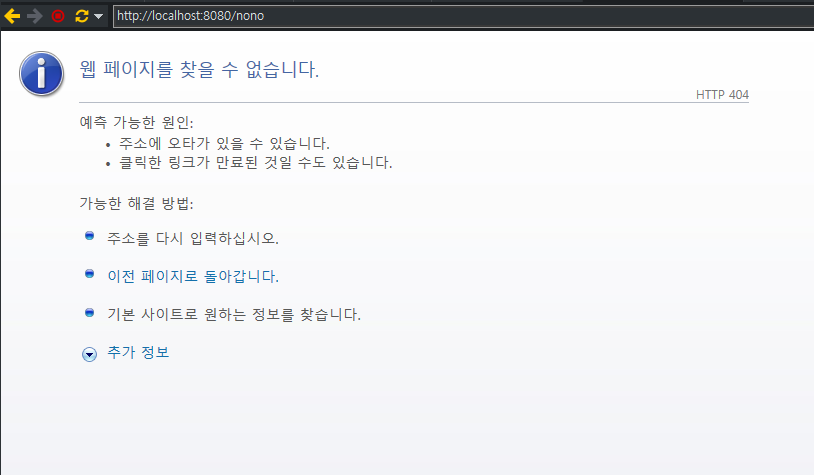

## Controller의 Exception 처리

다음과 같은 처리방법이 있다.

1. `@ExceptionHandler`와 `@ControllerAdvice`를 이용한 처리
2. `@ResponseEntity`를 이용하는 예외 메시지 구성

<br>

### @ControllerAdvice

AOP를 이용하는 방식. 공통적인 예외사항에 대해서 별도로 `@ControllerAdvice`를 이용해서 분리하는 방식이다.

- 새로운 패키지(exception)에 클래스 작성

  ```java
  @ControllerAdvice	// 스프링의 컨트롤러에서 발생하는 예외를 처리하는 존재임을 명시하는 용도.
  @Log4j
  public class CommonExceptionAdvice {

  	@ExceptionHandler(Exception.class)
  	public String except(Exception ex, Model model) {

  		log.error("Exception ......" + ex.getMessage());
  		model.addAttribute("exception", ex);
  		log.error(model);
  		return "error_page";
  	}

  }
  ```

- 새롭게 추가한 패키지는 servlet-context에서 인식하지 않는다. 추가해주기.

  ```xml
  <context:component-scan base-package="org.werock.exception" />
  ```

  > _❓ 근데 servlet-context와 root-context 각각 component-scan을 따로 쓰는데, 차이점은? ★_

- View단 (error_page.jsp)

  ```html
  <%@ page language="java" contentType="text/html; charset=UTF-8"
  pageEncoding="UTF-8"%> <%@ taglib uri="http://java.sun.com/jsp/jstl/core"
  prefix="c" %> <%@ page session="false" import="java.util.*" %>
  <!DOCTYPE html>
  <html>
    <head>
      <meta charset="UTF-8" />
      <title>Insert title here</title>
    </head>
    <body>
      <h4><c:out value="${exception.getMessage() }"></c:out></h4>

      <ul>
        <c:forEach items="${exception.getStackTrace() }" var="stack">
          <li><c:out value="${stack}"></c:out></li>
        </c:forEach>
      </ul>
    </body>
  </html>
  ```

<br>

### 404 에러페이지 처리

가장 흔하게 발생하는 에러 코드이고, 클라이언트 측에 잘못이니 조금 다르게 처리하는 게 좋음.

- web.xml에 코드 추가

  ```xml
  <!-- //404에러 처리 -->
  <init-param>
  	<param-name>throwExceptionIfNoHandlerFound</param-name>
  	<param-value>true</param-value>
  </init-param>
  <!-- 404에러 처리 // -->
  ```

- ControllerAdvice 클래스에 추가

  ```java
  // 404 에러처리
  	@ExceptionHandler(NoHandlerFoundException.class)
  	@ResponseStatus(HttpStatus.NOT_FOUND)
  	public String handle404(NoHandlerFoundException ex) {
  		return "custom404";
  	}
  ```

- _❓ custom404.jsp로 view단 처리를 했는데, 왜 계속 아래와 같이 표기되는 걸까..?
  (근데 사실 이렇게 표시해주는 걸 많이 봤지.)_

      
