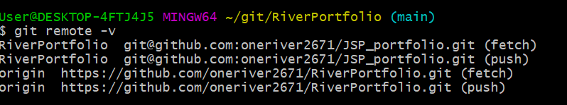
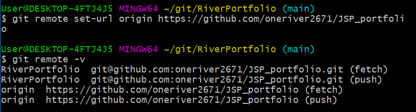

# Git Bash를 사용해 저장소 url 변경하기

Github에서 repository 이름을 바꿨더니, 이클립스에서 push가 안된다. 찾아보니 원격저장소 url은 변경되지 않았기 때문.

`Git Bash`를 이용해 아래와 같이 바꿔줬다.

### 버전확인

- `remote -v` : 현재 Repository url 확인

  

  origin 부분을 보면 아직 예전 변경 전 주소인 상태.

### url 변경

- `git remote set-url origin [repo 주소]`

  

  ⇒ 확인해보니 변경이 잘 되어있다.
