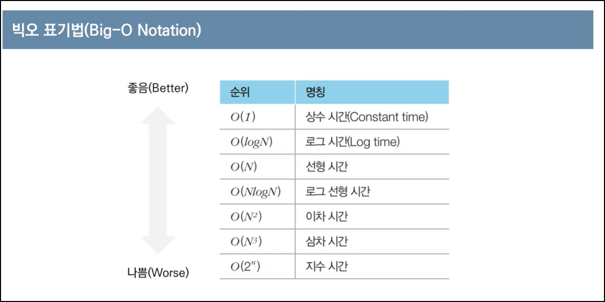

- 코딩테스트를 시행하는 이유
    1. 문제 해결 역량 평가
    2. 응시자의 수를 효과적으로 줄일 수 있음 (특히 대기업 공채에서 효과적임)
- 온라인 / 오프라인 차이
    - 온라인 : 보통 인터넷 검색 허용됨
    - 오프라인 : 검색 허용되지 않는 경우가 많음
    - 둘 다 시행하는 경우도 있음
- 문제의 시간제한은 통상 1~5초 가량
- 문제에서 가장 먼저 확인할 사항
    - 시간제한(수행시간 요구사항). 요구사항에 따라 적절한 알고리즘을 설계해야 함.
- 알고리즘 문제 해결 과정
    1. 지문 읽고 컴퓨터적 사고
    2. 요구사항(복잡도) 분석
    3. 문제 해결을 위한 아이디어 찾기
    4. 소스코드 설계 및 코딩

1. 백준 온라인 저지
    
    [Baekjoon Online Judge](https://www.acmicpc.net/)
    
2. 프로그래머스
    
    [프로그래머스](https://programmers.co.kr/)
    
- 가장 출제 빈도가 높은 알고리즘 유형
    - 그리디 (쉬운 난이도)
    - 구현
    - DFS/BFS를 활용한 탐색

### 복잡도

- 복잡도 : 알고리즘의 성능을 나타내는 척도
    - 시간 복잡도: 특정한 크기의 입력에 대하여 알고리즘의 수행 시간 분석
    - 공간 복잡도: 특정한 크기의 입력에 대하여 알고리즘의 메모리 사용량 분석
- 일반적으로 복잡도가 낮을수록 좋은 알고리즘임
- 어떻게 표기할 수 있을까? ⇒ **빅오 표기법(Big-O Notation)** 사용
    - 가장 빠르게 증가하는 항만을 고려하는 표기법.
    
    
    
